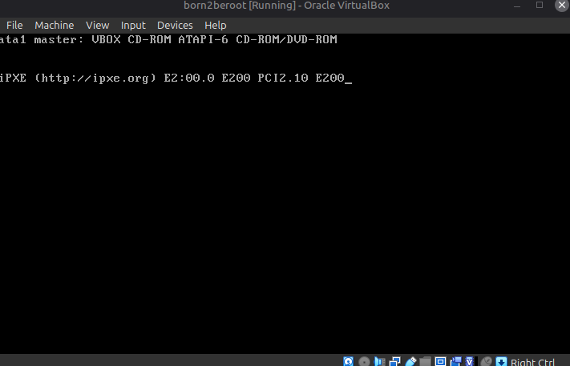

# Downloading VirtualBox
first of all i started by downloading **Oracle VirtualBox** (i prefered downloading via a package manager)

installing VirtualBox via the package manager provides several advantages over downloading a .deb package manually through a web browser. the package manager automatically select the exact build for our specific (Linux Mint) distribution and kernel version. and package manager itself automatically identifies, downloads and configures all required background libraries withut requiring manual tracking.

i already had VirtualBox on my system and i needed to remove it so that the new and old VirtualBox packages don't conflict:
1. `sudo apt remove --purge virtualbox virtualbox-qt virtualbox-dkms`
**--purge:** completely wipes the software along with all associated system-wide configuration files
**virtualbox virtualbox-qt virtualbox-dkms:** the specific package names causing conflicts (the main virtualization engine, the graphical user interface, and the dynamic kernel module support package)

2. `sudo apt autoremove -y && sudo apt clean`
**autoremove:** scans the system for leftover dependencies
**-y:** automatically answers "yes" to all system confirmation prompts.
**clean:** deletes downloaded .deb installer files from the local package cache to free up disk space

to fetch the lastest list of available software packages and their versions from the official remote linux mint and ubuntu repositories:
3. `sudo apt update`

4. `sudo apt install virtualbox virtualbox-ext-pack -y`
**virtualbox-ext-pack:** the official Oracle extension pack
**virtualbox:** the core hypervisor binary and user interface.

---

# Downloading Debian ISO file
continued by downloading the latest stable version of Debian.

search engine -> Debian -> other downloads -> complete installation image (under the 'Download an installation image' header) -> Download USB/CD/DVD images using HTTP -> Official USB/CD/DVD images of the "stable" release -> architecture selection (amd64 for me) -> download debian-13.6.0-amd64-netinst.iso

## How to find your system architecture?
you can verify your host machine's architecture using the command lines:

`uname -m` (for linux)

Output: x86_64

**-Breakdown of the output-**

x86 : derived from intel's early CPUs ending in '86' (8086, 386, 486). identifies the fundamental x86 processor instruction family.
64 : represents 64-bit memory addressing and register size (max amount of data). 
    --> register size determines the chunk size of data the cpu can handle at once.

---

# Creating the virtual machine

Oracle VM VirtualBox Manager -> New

1. Name the virtual machine to your liking. i prefered born2beroot.
2. Folder specifies the destination directory where VirtualBox saves the virtual machine’s configuration files and virtual hard disk drives. Any local directory with at least 10-15 gb of free space is ok. (goinfre)
3. ISO Image part specifies the downloaded Debian network installer ISO
(after choosing the ISO, Oracle VM VirtualBox Manager detected my computer's OS type as Debian 64-bit by itself. so didn't have to select for edition, type and version. You might need to select manually.)
4. select 'Skip Unattended Installation'
    The subject strictly requires a manual installation process to set up at least 2 encrypted partitions using LVM. We are supposed to manage the disk manually. If we don't skip Unattended Installation, VirtualBox quickly perform a basic Debian installation in the background without letting you access the LVM encryption and user creation screens. This situtation leads to -42.

in the next page (hardware), in order to maintain a minimal server (as required by the project), these are the recommended values:

RAM: 1 GB (enough) or 2 GB (for a better performance -> to speed up package installation and overall responsiveness)
Processors: 1 or 2 CPU

since born2beroot is a minimal server environment without a GUI and we are supposed to use lightweight background services like OpenSSH, Cron/shell scripts, IPTable etc (a few mb of ram total), 1 gb ram and 1 processor is more than enough. Additionally, the base linux kernel uses roughly 100-150 mb of ram at idle. Leaving 850+ mb free for general operations (e.g. active ssh sessions, shell instnces, package operations, running monitoring.sh)

do not select 'Enable EFI (special OSes Only)'

**EFI (Extensible Firmware Interface) or UEFI:** is the modern system firmware interface designed to replace the legacy PC BIOS. Should be enabled when setting up virtual disks larger than 2 TB. Minimal linux servers don't require enabling EFI.

on the next page, we configure the virtual hardk disk. according to the lsblk output in the project subject, an 8 gb disk is sufficient for the required partitions. however, to avoid running out of space during package installation and logging, setting it to 10-15 gb seems safer.

leaving 'Pre-allocate Full Size' disabled so that the host won't take up the entire specified size right away. Now the host storage drive can start small and grows as we use it.

on the next (Summary) page, select 'Finish'

# Setting up the virtual machine

> **REMEMBER :** you can pause the VirtualBox where you are and resume later without losing any installer progress.
1. Close the VirtualBox window by clicking the X in the top-right corner.
2. Select "Save the machine state" and click OK.
3. VirtualBox will freeze the RAM and current installer state onto your computer's disk. When you re-open VirtualBox and click Start, it will resume at this exact screen.

and then we can Start our virtual machine by selecting freshly created vm and Start

after launching, we are greeted by the installer menu.

the project subject strictly forbids the GUI usage, so continue with 'Install'

select the language, country and keymap

after a moment, we are represented with a screen where we need to enter a hostname.
the project subject tells 'the hostname of your virtual machine must be your login ending with 42'

i didn't see any requirement for domain name on the project subject pdf. since our debian vm is a standalone local server, an external domain name is kinda unnecessary and the project subject only requires a specific hostname. so i left domain name empty.

in the next page, the installer wants us to set a root password. i was told not to forget this password since we will be using this password later on. in case, note these kind of stuff all the time.

on the next pages, we are setting up users and passwords.

according to the project subject, user with our login as the username has to be present (we will make this user a member of user42 and sudo groups)

for the new user, i preferred leaving the 'Full name for the new user' as it is. not as necessary as the username.

set a password for this user too. of course, do not forget this password either.

selecting the time zone doesn't seem that important to me rn, i chose Central for now. can change the zone later if necassary.

---

# Manuel Disk Partitioning

since we were told (in the project subject) that we need to determine the appropriate size for each partition to ensure proper operation while avoiding unnecessary disk usage, we will use the manual partitioning method:

and then we are greeted by a disk management dashboard. we will choose which hard drive we want to modify. we are supposed to choose the middle one here since we are doing a %100 manual disk setup. 

by selecting 'SCSI3 (0,0,0) (sda) - 16.1 GB ATA VBOX HARDDISK', we are turning of the automatic installer to build the partition table, the /boot partition, the encryption layer and the LVM volymes ourselves.

'SCSI3 (0,0,0) (sda) - 16.1 GB ATA VBOX HARDDISK' represents our raw, empty VirtualBox hard drive. it currently has no partitions, no file systems and no data on it.

**-breakdown-** 

**SCSI3 (Small Computer System Interface Generation 3):** the virtual controller interface protocol VirtualBox uses to communicate with the drive

**(0,0,0):** the hardware address numbers (adapter, bus, target/LUN ID) assigned to this disk on the virtual controller
    - Adapter: the virtual storage controller card plugged into your virtual motherboard??
    we only have one primary storage controller configured in our VM settings, so it gets index 0. if we added a secondary PCI storage controller card, its drives would start with Adapter 1
    - Bus: the internal data pathway (or channel) attached to that specific controller adapter.
    - Target / LUN ID: the specific device port number on the bus
        - LUN (Logical Unit Number): a sub-address used when a single physical storage target hosts multiple logical drives.
    virtualBox assigns your virtual disk (.vdi) to the very first storage port (Port 0) on the virtual controller. that's why the third value is 0

**(sda):** the linux device name.
    - sd: SCSI disk (standart linux prefix for SCSI drives)
    - a: the first storage drive detected by the system. (a second drive would be sdb)

**ATA (Advanced Technology Attachment):** the virtual storage bus type emulation.

**VBOX HARDDISK:** The hardware device model name generated by VirtualBox.

**Other selections:**
- Guided partitioning: a shortcut back to the automated wizard screen you just left.
- Configure iSCSI volumes: an advanced tool to connect storage over a network interface. we are configuring a local virtual hard disk (.vdi) inside VirtualBox. not remote network storage. so skip this one too.
- Undo changes to partitions: a reset button that discards any changes, partition creations, or formatting choices made during the current installation session.
- Finish partitioning and write changes to disk: the final confirmation button used to save your completed partition scheme. selecting this now will cause an error because no partitions or file systems have been created yet.

on the next page the installer asks to create new empty partition table. the whole time, the purpose was to create an empty table. choose yes.

selecting pri/log (FREE SPACE) here launches the partition creation wizard.

select 'Create a new partition'

let's take a look at the given partition table example and fill out the new partition sizes according to the project subject:

> lsblk (list block devices) command displays detailed information about all available block devices such as hard drives, SSDs, USB drives and their respective partitions.

sda1 (/boot):

### Primary and Logical types for partitioning

when using partition table on a hard drive, linux divides the disk using these two types:

- **Primary:** is the main partition on the disk. 
> an MBR (msdos) disk can have a max of 4 primary partitions.
> primary type is used for critical system startup files (like /boot). the BIOS and bootloader (GRUB) can read Primary partitions directly to start the operating system.

- **Logical:** A sub-partition created inside a special Primary partition called an Extended Partition.
> it bypasses the 4-partition limit, allowing you to create extra partitions.
> used for extra data storage or additional system drives when you run out of primary slots.

Setting /boot as a Primary partition at the Beginning of the disk ensures the system can locate and read the boot files cleanly before any complex drivers are loaded.

choosing 'Beginning' places /boot  at the front of the drive so that GRUB (bootloader) can immediately find it.

'End' is typically used for non-urgent partitions.

following screen shows us the details of the partition. We will modify the mount point according to the project subject.

> What is 'mounting'
    The process of attaching a disk partition (or USB drive) to the operating system so Linux can read and write data to it

> What is 'mount point'
    the specific folder used as the entry door to access that mounted disk space.

-Simplified Analogy-
- Disk / Partition: a room full of storage boxes
- Mounting: unlocking the door and connecting that room to your hallway
- Mount Point: the label on the door (such as /boot or /home) that you open to step inside that room

select 'Mount point'

set the mount point to /boot

we are not going to modify any other setting:

- _**Use as:** Ext4 journaling file system :_ defines how data is formatted and organized on the partition, Ext4 is the standart for linux file system, GRUB and linux kernel fully support reading Ext4 without needing any extra drivers, so leave it as it is.

- _**Mount options:** defaults :_ sets system permissions and behaviors (read-write access, executing binaries) when mounting the partition. _defaults_ includes all basic r/w flags required.

- _**Label:** none :_ an optional text name assigned to the drive volume for identification. Linux uses device names (/dev/sda1) internally, custom labels are for nothing but styling it. unnecessary here.

- _**Reserved blocks:** 5% :_ keeps 5% (25 mb for this specific partition) of the partition's space locked for the root user to prevent complete system lockup if a disk fills up to 100%. it is a built-in kernel safety net. this setting ensures that the root user can still log in and run emergency cleanup commands if a normal user or daemon accidentally fills 100% of the available user disk space.
    > **daemon:** deamons start automatically when the system boots and run quietly behind the scenes without opening a terminal/user interface. in Linux, daemons usually end with a 'd' (crond, systemd, sshd etc.). daemons can handle system monitoring, listen for incoming network connections, write logs, or manage hardware devices.

- _**Typical usage:** standart :_ adjusts how many files can exist on the disk. standart is optimized for normal file and directories. /boot only holds a handful of large kernel image files, standart works for us here.

- _**Bootable flag:** off :_ a legacy MBR flag used by older PC systems to decide which partitions to read first. modern GRUB bootloaders on linux ignore this flag because GRUB is installed directly into the Master Boot Record (MBR) sector at the front of sda

once we are done with the partition settings, the partition will appear on the partition table.

The born2beRoot subject requirement states: "You must create at least 2 encrypted partitions using LVM."

> **An encrypted partition** is a physical or logical disk area where all raw data is mathematically scrambled using a cryptographic algorithm (LUKS/AES in Linux). Without entering the correct password at boot to decrpyt it, the data remains unreadable to anyone pulling the hard drive out.

> **LVM (Logical Volume Manager)** is a storage abstraction layer in Linux that allows you to manage disk space flexibly. in traditional partitioning, we devide a physical hard drive directly into fixed partitions (like sda1 in my project), which are difficult to resize or extend. LVM places a management layer between physical disks and the file systems, letting you treat disk space flexibly.

one more time, let's take a closer look at the given lsblk output example:
- sda5 is the physical partition on disk
- sda_crypt is the decrypted container unlocked by your password
- wil--vg-root, wil--vg-swap_1, and wil--vg-home are individual encrypted logical volumes inside that single decrypted container.

since all three stands inside the sda5_crypt container, all three are encrypted. i will use the example from subject for my project.

selected the FREE SPACE so that i can create a new partition.

as in the example, out of the total disk size (8GB), around 500 mb (487) was allocated to /boot (sda1), and the remaining 7.5GB (max) was given to sda5. i will do the same partitioning.

[Click here to remind yourself tthe Logical partioning type](#logical)

on an MBR disk, primary partition numbers are reserved for slots 1 to 4 (sda1/2/3/4)

logical partitions are created inside an Extended partition (which takes up one of those primary slots, like sda2).
means:
- sda1 is our Primary (/boot) partition
- sda5 is our first Logical partition, placed right after sda1
- sda2 is the Extended container holding the logical space

We reserve and use Logical partitions for any scenario where you need more than 4 total partitions on a traditional MBR disk, or when you want to isolate non-critical user and system data away from the main primary boot files.

Continuted with Logical type

on the next screen, select 'Mount point':

select 'Do not mount it':

sda5 is a raw container and its job is encryption. it will serve as the raw physical host for our encrypted container. the actual file systems and mount points will be created inside the LVM volumes that sit on top of this encrypted layer. (in the project subject, we can see that sda5 is not mounted there either)

after setting the mount point to none, select 'Done setting up the partition' and then we will be able to see the new partition on the partition table.

we can go for creating the encrypted volumes, select 'Configure encrypted volumes'

select 'Yes' in order to write the current partitioning scheme to the disk before going on with the encrypted volumes. 

we will be using LUKS (Linux Unified Key Setup) as the encryption tool. Linux kernel cannot build an encrypted LUKS container on top of a partition that does not technically exist on the physical drive yet.

now we can create the encrypted volumes:

select the partition you want to perform the encryption on. we better not select sda1 (/boot), because when our computer turns on and the bootloader is loaded, GRUB needs to read the Linux kernel and initial RAM disk from /boot to start the operating system

or

if /boot is encrypted, GRUB itself must contain the LUKS decryption drivers to prompt us for a password before the linux kernel is even loaded, which is too complicated to be worth it. 

and

standart Linux architecture requires the standart design pattern across Linux distibutions is to keep a _small_, _unencrypted_ /boot partition so that GRUB can easily hand control over the kernel. the kernel handles prompting for the passphrase and decrypting the rest of the disk (which will be sda5_crypt in my project)

and select 'Continue'
 

select 'Done setting up the partition'

leave the remaining settings as it is:
- Use as: physical volume for encryption (neat as day)
- Encryption method: Device-mapper (dm-crypt) --> is a tool in the Linux system that locks and hides data on hard drives so people cannot read it without the correct password. Often works with LUKS.
- Mount point: none --> an encrypted raw partition is simply a locked box (dm-crypt container). it doesn't contain a filesystem like Ext4 that Linux can attach to a folder directory. Leaving Mount point as none is mandatory so the installer knows to treat this partition purely as an encrypted container for LVM, rather than trying to mount it directly to the system
- Mount options: defaults --> this option applies to how filesystem flags (dev, auto, exec, async, suid, rw etc.) are passed when mounting. Because this raw partition isn't being mounted directly, altering mount options here has no functional effect on the setup.
- Encryption: aes, Key size: 256 --> AES-256 is the current standart for symmetric encription. provides maximum data protection.
- IV algorithm: xts-plain64 --> XTS is the recommended Cipher Block Chaining mode specifically designed for full-disk encryption. Selecting older initialization vector (IV) modes like cbc-essiv might lead to make the volume more vulnerable to targeted cryptographic attacks
- Encryption key: Passphrase --> this tells LUKS to prompt you for a password when booting up the virtual machine
- Erase data: yes --> keeping it as 'yes' hides the real data volume. An attacker looking at the drive won't be able to tell where your actual files end and where empty space begins. it will all look like random noise. It erases any leftover traces of old files that were on the disk before. you can save about 1–2 minutes during installation. however, old data remnants might stay on the drive, and an attacker can see exactly how much real data you actually have stored inside the encrypted container.
- Bootable flag: off --> label that tells your computer's motherboard to start the computer from the specified partition. the system cannot directly start from and encrypted partition because it can't read the files inside without the password first. it won't work anyway if we set it to 'on'

selected 'Finish' since i want to follow the example on the project subject and don't want to create more encrypted volumes.

The following screen is asking if you want to fill your new encrypted partition with random data before formatting it with LUKS. when preparing an encrypted volume, the installer offers to overwrite the entire partition space with random noise (0s and 1s). filling the partition with random noise prevents attackers from inspecting the raw drive later to tell the difference between actual encrypted files and unused empty space. 

might take a few minutes to finish

now we are supposed to enter a password but this time it will be the encryption passphrase, remember it.

to sum up,

- after setting up /boot (sda1), we selected the remaining FREE SPACE and assigned the max size.
- when asked for the partition type, we chose Logical

--> the moment we chose Logical, Debian automatically named that 5th partition slot as 'sda5' on disk.

- immediately after, we went into 'Configure encrypted volumes' and set a passphrase

--> Debian took that raw sda5 partition, applied the LUKS encryption layer on top of it, and mapped the decrypted, unlocked container as sda5_crypt.

sda5 : the raw physical partition on the virtual disk

sda5_crypt : the unlocked, decrypted container that sits on top of sda5 for LVM to use 

## Configuring the Logical Volume Manager

we will configure the logical volume manager

write the current partitioning scheme to the disk

finally, sda_5crypt is sitting physically and ready as an encrypted storage space.

and now, it's time to create logical volumes. before that, we need to create a volume group that holds the logical volumes. because, we cannot create logical volumes directly on a physical volume. lvm architecture enforces that logical volumes must live inside a volume group.
--> the volume group abstracts the raw disk space. instead of dealing with fixed physical boundaries, the volume groups turn sda5_crypt into a continuous pool of storage blocks (extends) that you can allocate, shrink, or expand dynamically. 

on the next screen we are expected to enter a volume group name. 

i will stick with the mandatory part and skip the bonus section, but still i want to use 'LVMGroup' as vg name as indicated in the bonus example.

Linux device mapper automatically replaces single hyphens with (-) double hyphens (--) in the system path diplay. and seperates the volume group name and the logical volume names with a (-). we can modify the volume group name later anyway.

/dev/mapper/sda5_crypt is our encrypted storage protected by LUKS. by building the volume group inside it, every logical volume we create automatically becomes encrypted

## Configuring Logical Volumes

select 'Create logical volume' just like the project subject wanted (at least 2 partitions using LVM)

ofc we have only one choice, select it

on the next screens, we fill out the name and size as indicated in the mandatory part for the logical volumes we create.

repeat the same thing for all of the logical volumes shown in the mandatory partition table.

after you are done with creating the logical volumes, select 'finish'

on the next screen, we can see that we have created our 3 logical volumes inside LVMGroup. 

we can also see that instead of a drawing nested tree, we see each virtual device block seperately. the reason they appear as seperate top-level blocks in this interface is simply because of how the Debian installer renders different device-mapper devices.

> a device-mapper device is a virtual storage layer created by kernel

instead of writing data directly to a physical hard drive, Linux uses the Device Mapper framework to pass data through virtual translations (like encryption or logical volume management) before it touches the physical disk.

every time we add a virtual layer on top of our raw disk (sda), Linux creates a new device-mapper device under /dev/mapper/. in our setup, we have 4 device-mapper devices running.

physical disk itself (sda5) ---> not a device mapper device.
    /dev/mapper/sda5_crypt  ---> device-mapper device #1 (LUKS encryption layer)
        volume group (LVMGroup)
            /dev/mapper/LVMGroup-root ---> device-mapper device #2
            /dev/mapper/LVMGroup-swap_1 ---> device-mapper device #3
            /dev/mapper/LVMGroup-home ---> device-mapper device #4

for the next step, we are supposed to configure all of them. select the first one appearing, which is 'home' in my project

we only created an empty, unformatted slice of space so far. the installer needs to know how to format it and where to attach it in the system. so select 'Use as'

we need to choose Ext4 for home (and also for root) because LVM and encryption do not provide a file system. they only manage raw storage blocks.

- LUKS (sda5_crypt) only scrambles raw bits on the disk for security

- LVM (LVMGroup) only measures out the physical boundaries of the virtual partitions (home, root, swap)

- Ext4 (file system) is the actual index book that organizes data into folders, files, permissions and file names so the operating system can read and write to it. (Ext4 is the standart reliable Linux file system used for general storage partitions btw)

without choosing a file system like ext4, Linux just sees LV home as a raw block of 4.0 GB of empty noise and cannot write any files or directories inside it

after continuing with Ext4 file system, we are greeted by the other configurations on the next screen. we also need to set the mount point so that the operating system knows where to attach /home logical volume. 

by setting the mount point to /home, from now on, whenever /home directory is accessed by a user, those files are read and written directly inside this encrypted logical volume.

leave the other setting as default and done setting up the partition. (i had mentioned about the other settings earlier)

now repeat the same process for all of the other logical volumes except swap.

you should modify swap's settings. according to the subject, swap's device-mapper is swap area. 

choose: 'Use as: swap area'. and done setting up the partition

after you are done with configuring logical volumes -> Finish Partitioning and write changes to disk

on the next screen, Debian's installer asks us if we have any secondary ISO files. i prefer to download all additional packages (sudo, ufw, openssh-server etc.) required for the project from the internet over the debian network. i will skip this step.

for the next step, we need to select a country that is specific to you. it does not change anything but download speed for our project. choosing the archive mirror country simply determines which server location your package manager (apt) connects to when downloading tools.

select deb.debian.org as Debian archive mirror.

**deb.debian.org** is the official default recommended by Debian. it automatically picks the fastes working server for you. additionally, if local regional servers go down, it instantly switches to a backup server so it never fails. 

Debian's installer asks us if we want to add a HTTP proxy. we want to connect directly to the internet. home internet and 42 campus networks allow direct connections, so no proxy information is needed here. just leave it as it is and continue.

i had an error at this point. the reason might be the virtual machine lost internet connection or couldn't resolve the DNS address for deb.debian.org. i selected 'Go Back'

configure package managers > rejected extra installation > choose Turkiye > select ftp.tr.debian.org > leave the HTTP proxy information empty

and waited for a few minutes for installations

the installer asks if we want the developers to see our statistics. since we are doing our best to minimize background processes, cron jobs and unnecessary network traffic as born2beroot requires, we better say 'no'

on the next step we will uncheck all of the selected softwares.

- unchecked web server because the mandatory part does not require a web server and i don't intent to complete the bonus section. 
- unchecked SSH server, because it comes with pre-configures defaults. the installer automatically configures openssh-server to run on default port 22. but the project requires SSH to run on port 4242, with root login disabled for security reasons, and managed behind ufw.
- checking other debian desktop environments installs a heavy desktop interface with windows, icons, and a mouse pointer. as the project subject indicates, installing GUI violates the project requirements and will result in an immediate fail

as we mentioned previously, GRUB (Grand Unified Bootloader) is the first program that runs when the virtual machine boots up. it locates the Linux kernel on the drive, initializes the LUKS decryption process, and loads Debian into memory. without installing GRUB to our primary drive, our vm will have no instructions on how to start the operating system, resulting in a "no bootable device found" error on startup. press enter on 'Yes'

choose the device for boot loader instlalation

# Virtual Machine Configuration

after the installation setup, we'll see GRUB Bootloader menu appears on the screen.

the first thing we do is select Debian GNU/Linux which is already selected and highlighted.

GRUB has a built-in 5-second timeout counter. if you don't press any key within 5 seconds, it automatically boots the default highlighted option (which is Debian GNU/Linux in our system)

on the next screen, we are greeted by the LUKS disk decryption prompt. pass the passphrase you previously set up.

enter non-root user credentials

## installing 'sudo'

let's start with installing sudo, we must be root before attempting to install sudo because new debian installations do not grant normal users administrative privileges by default.

but why do we need sudo anyway? as you can guess, logging in as root continuously is dangerous. one wrong command can instantly wipe or break the system. we install sudo so that normal users can safely perform administrative tasks without having to log in directly as root every time. besides the fact that we need it, project specifies installing 'sudo'

we can use `su` command. this command switches the user identity to 'root' which might be risky for me at this point because i don't know where the system administrative tools. using 'su' makes you remain in the regular user's directory (/home/ekablan) and keeps your normal user's environment variables (like $PATH, home directory, and configuration files)

i could probably get confused at some point. 

i preferred `su -` because it performs full login shell as root. completely loads root's environment variables, resets the $PATH variable to include system administration paths, and changes your current directory to /root. provides a clean, isolated environment guaranteed to locate administrative tools.

we will use apt to install sudo. apt (Advanced Package Tool) is a package management system that is pre-installed by default as part of the Debian installation. we can use apt to handle installation and removal of software on Debian and Debian-based linux distributions.

fetch the latest package repository lists using apt:
`apt update`

install the sudo package:
`apt install sudo`

let's verify whether sudo is installed or not:
`dpkg -l | grep sudo`

- **dpkg (Debian Package manager):** the core low-level tool in debian used to manage, install, remove and query .deb package files on the system.

- **-l:** instructs dpkg to list every single package currently intalled or configured on the operating system.

- **| (pipe symbol):** takes the standart output (the list of packages produced by dpkg -l) and passes it directly as input into the next command, rather than printing the entire list onto your screen.

- **grep sudo:** grep (Global Regular Expression Print) is a search tool that scans incoming text line by line and filters out only the lines that match a specific pattern (sudo)

in the output, we can see sudo is installed _**(ii)**_

>the first letter (i) represents the 'desired package state'. i stands for 'install'
- other desired package states: u (unknown), r (remove/deinstall), p (purge), h (hold)

> the second letter (i) represents the 'current package state'. i stands for 'installed'.
- other current package states: n (not installed), c (config files), U (unpacked), F (half configured - failed), h (half installed - failed), W (triggers-awaited : package is waiting for a triggger), t (triggers-pending : package has been triggered)

## adding user to sudo group

now we can add the user to the sudo group. (according to the subject, the user has to belong to user42 and sudo groups)

adding user to the sudo group, grants broad permissions to use sudo. in debian, any member of this group is allowed to run commands as root.

we don't need to create a sudo group additionally, the installation script automatically created the sudo group in the system files when we installed the sudo package. after adding the user to sudo group, i checked which users belong to sudo group.

> **adduser** and **getent** are fundamental linux administration tools used for managing user accounts.

- **adduser:** a high-level interactive command-line tool used to create a new user account on the system. can be used also for adding existing users to an existing group. (`adduser ekablan sudo`)

- **getent:** short for 'get entry'. it fetches records from linux administrative databases (defined in /etc/nsswitch.conf) such as users, groups, or network hosts. `getent group sudo` displays the sudo group entry and lists all users assigned to it.

from now on, since ekablan is a member of sudo group, ekablan user can use 'sudo' with all of the administrative privileges.

this line indicates that every user assigned to the sudo group, inherits full administrative permission:

this line gives all we want, we don't need to add ekablan user under the '# User privilege specification' anymore.

i ran `groups` to verify if the active shell session reflected the new sudo group membership.

it doesn't show sudo. 

> the underlying reason is: when we logged in (ekablan), Linux created a session 'permission token' in RAM based on /etc/group at that moment. adding ekablan to the sudo group updated the /etc/group file on the hard drive, but our running shell session was still using the old token cached in memory.commands like 'groups' check the session's memory token, which is why sudo wouldn't show up.

i tried re-authenticating to my session.

This command was meant to open a fresh shell session as the current user 'ekablan' with updated group permissions. but it didn't work. idk why

decided rebooting since it is the cleanest definitive solution. rebooting saves the changes to the disk. any files, installed packages, modified configurations etc are written directly to the disk when rebooting. use `reboot`

but it got stuck for like 5 minutes

so i gave up waiting and power off the machine and than started it again. worked. didn't question it and moved on.

after rebooting, i logged back in as ekablan and ran `groups`. sudo group now appeared in the output, confirming that the new session security token successfully loaded the updated group permissions from disk:

> **additional note:** even before rebooting, running `sudo whoami` returned 'root' because sudo reads group memberships directly from disk (/etc/group) on execution. however, rebooting was necessary to refresh the shell's session memory token so that standard commands like groups also recognize the updated membership

## getting SSH service

the project subject indicates that there must be an SSH service

- [ ] must be running on port 4242
- [ ] must not be possible to connect using SSH as root for security reasons

### What is SSH?

**SSH (Secure Shell)** is a secure and encrypted network protocol that allows you to connect to and manage a remote computer or server via the command line.

it encrypts all username, password, and command data sent over the internet or a local network. this ensures that even a third party intercepts the data, they cannot read it as plain text.

#### What is SSH Service (SSH Daemon / sshd)?

the ssh service (sshd / OpenSSH server on Linux) is a program running continously in the background of a server that listens for incoming SSH connection requests. means, to connect to a server via SSH, an SSH service must be installed and actively running on that target server.

1. The ssh server receives incoming connection attempts from a client
2. authenticates the user via password or key
3. provides terminal access upon successful verification 

rules such as which port the SSH service listens on or whether root login is allowed are configured in the `/etc/ssh/sshd_config` file

#### What is port?

a port is a virtual gateway (like a network slot number) used by network services running on a computer to communicate with the outside world. 

while a computer's address on a network is its IP address, the port number (ranging 0 to 65535) determines which specific application or service on that computer receives the data.

let's get back to the installation 

installing software modifies core system directories, installs background system services, and opens network ports. standart non-root users are restricted from making these system-wide changes. therefore we will install with root permission.

`sudo apt install openssh-server -y`

- 'openssh-server : the package name for the OpenSSH server daemon. This software allows secure, encrypted remote terminal connections (SSH) into your virtual machine
- '-y' : yes flag (says yes to any confirmation prompt)

and check if it is exists on the system, with `dpkg -l | grep ssh`

ii means installed as in mentioned previously.

