# Downloading VirtualBox
first of all i started by downloading **Oracle VirtualBox** (i prefered downloading via a package manager)

installing VirtualBox via the package manager provides several advantages over downloading a .deb package manually through a web browser. the package manager automatically select the exact build for our specific (Linux Mint) distribution and kernel version. and package manager itself automatically identifies, downloads and configures all required background libraries withut requiring manual tracking.

i already had VirtualBox on my system and i needed to remove it so that the new and old VirtualBox packages don't conflict:
1. `sudo apt remove --purge virtualbox virtualbox-qt virtualbox-dkms`
**--purge:** completely wipes the software along with all associated system-wide configuration files
**virtualbox virtualbox-qt virtualbox-dkms:** the specific package names causing conflicts (the main virtualization engine, the graphical user interface, and the dynamic kernel module support package)

2. `sudo apt autoremove -y && sudo apt clean`
**autoremove:** scans the system for leftover dependencies
**-y:** automatically answers "yes" to all system confirmation prompts.
**clean:** deletes downloaded .deb installer files from the local package cache to free up disk space

to fetch the lastest list of available software packages and their versions from the official remote linux mint and ubuntu repositories:
3. `sudo apt update`

4. `sudo apt install virtualbox virtualbox-ext-pack -y`
**virtualbox-ext-pack:** the official Oracle extension pack
**virtualbox:** the core hypervisor binary and user interface.

---

# Downloading Debian ISO file
continued by downloading the latest stable version of Debian.

search engine -> Debian -> other downloads -> complete installation image (under the 'Download an installation image' header) -> Download USB/CD/DVD images using HTTP -> Official USB/CD/DVD images of the "stable" release -> architecture selection (amd64 for me) -> download debian-13.6.0-amd64-netinst.iso

## How to find your system architecture?
you can verify your host machine's architecture using the command lines:

`uname -m` (for linux)

Output: x86_64

**-Breakdown of the output-**

x86 : derived from intel's early CPUs ending in '86' (8086, 386, 486). identifies the fundamental x86 processor instruction family.
64 : represents 64-bit memory addressing and register size (max amount of data). 
    --> register size determines the chunk size of data the cpu can handle at once.

---

# Creating the virtual machine

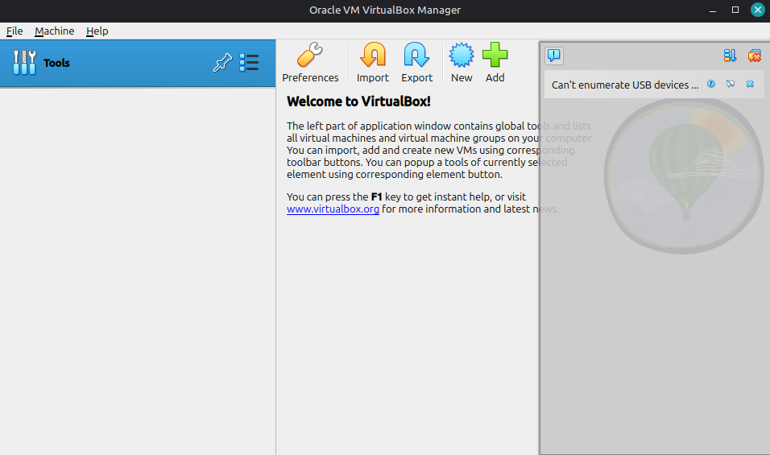

Oracle VM VirtualBox Manager -> New

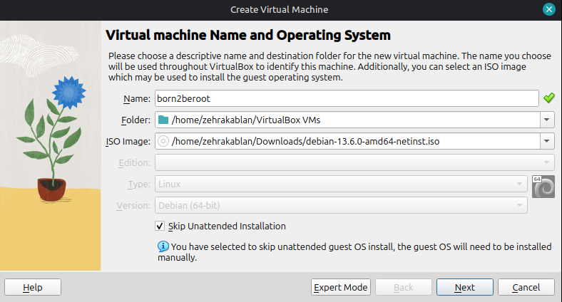


- Any local directory with at least 10-15 gb of free space is ok (goinfre). you should avoid using /sgoinfre because even though it offers large storage, it is a shared network drive. Running a 10–15 GB virtual machine file over the campus network causes heavy lag, slow package installations, and overall poor VirtualBox performance. Storing your VM files directly in /goinfre ensures the fastest read/write speeds, though you must remember that /goinfre files stay on that specific physical iMac and will not follow you if you change seats
- after choosing the ISO, Oracle VM VirtualBox Manager detected my computer's OS type as Debian 64-bit by itself. so didn't have to select for edition, type and version. You might need to select manually.
- select 'Skip Unattended Installation': the subject strictly requires a manual installation process. when Unattended Installation is enabled, VirtualBox quickly perform a basic Debian installation in the background without letting you access the LVM encryption and user creation screens. This situtation leads to -42.

---

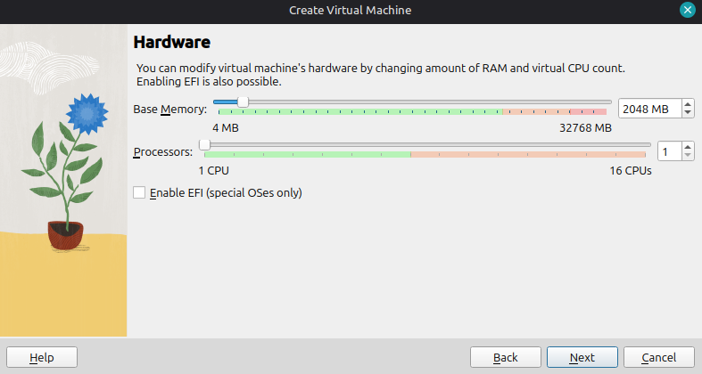

in the next page (hardware), in order to maintain a minimal server (as required by the project), these are the recommended values:

RAM: 1 GB (enough) or 2 GB (for a better performance -> to speed up package installation and overall responsiveness)
Processors: 1 or 2 CPU

since born2beroot is a minimal server environment without a GUI and we are supposed to use lightweight background services like OpenSSH, Cron/shell scripts, IPTable etc (a few mb of ram total), 1 gb ram and 1 processor is more than enough. Additionally, the base linux kernel uses roughly 100-150 mb of ram at idle. Leaving 850+ mb free for general operations (e.g. active ssh sessions, shell instnces, package operations, running monitoring.sh)

do not select 'Enable EFI (special OSes Only)'

**EFI (Extensible Firmware Interface) or UEFI:** is the modern system firmware interface designed to replace the legacy PC BIOS. Should be enabled when setting up virtual disks larger than 2 TB. Minimal linux servers don't require enabling EFI.

---

on the next page, we configure the virtual hardk disk. according to the lsblk output in the project subject, an 8 gb disk is sufficient for the required partitions. however, to avoid running out of space during package installation and logging, setting it to 10-15 gb seems safer.

leaving 'Pre-allocate Full Size' disabled so that the host won't take up the entire specified size right away. Now the host storage drive can start small and grows as we use it.

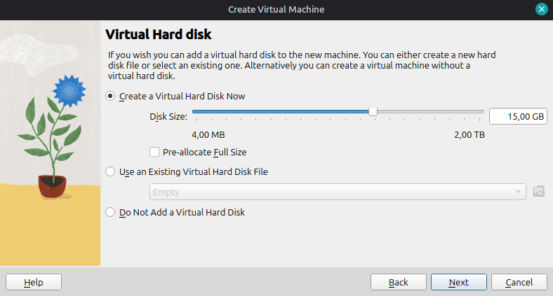

on the next (Summary) page, select 'Finish'

---

# Setting up the virtual machine

and then we can start the vm

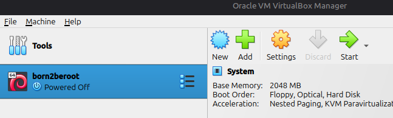

after launching, we are greeted by the installer menu.

the project subject strictly forbids the GUI usage, so continue with 'Install'

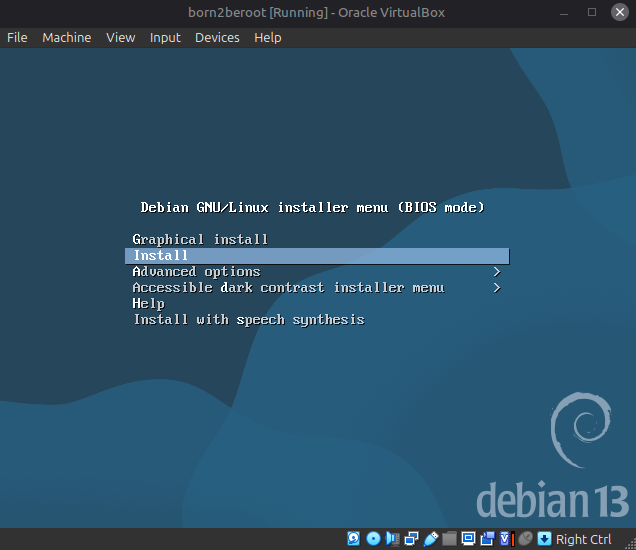

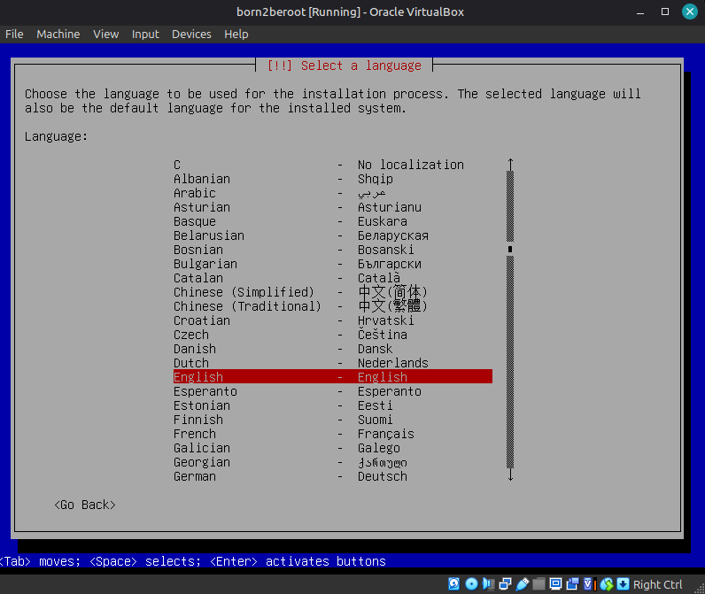

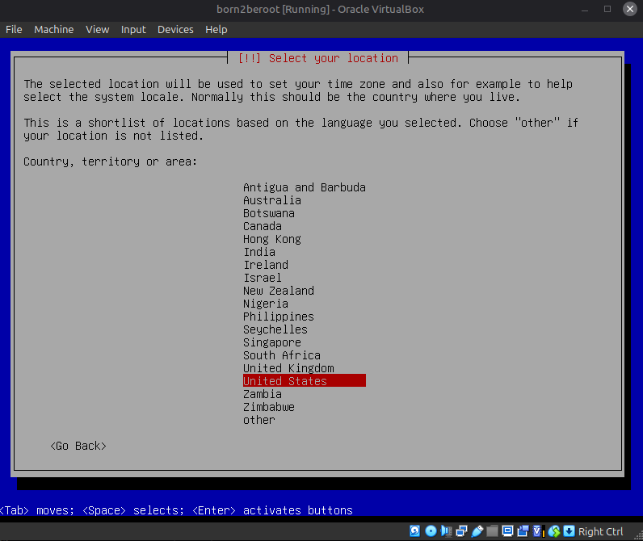

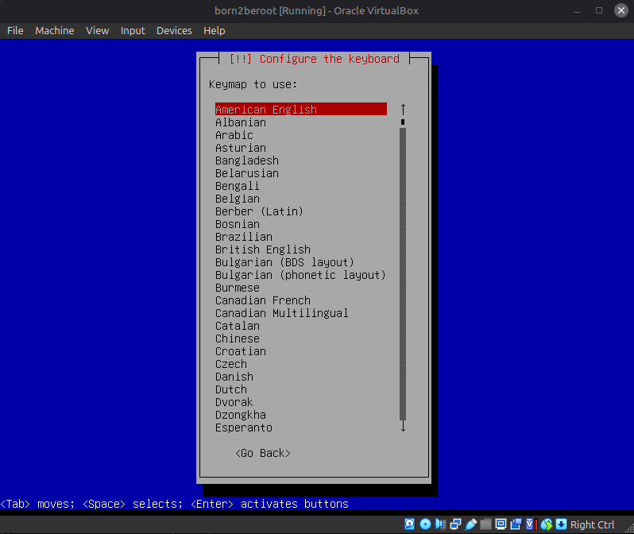

after a moment, we are represented with a screen where we need to enter a hostname.
the project subject tells 'the hostname of your virtual machine must be your login ending with 42'

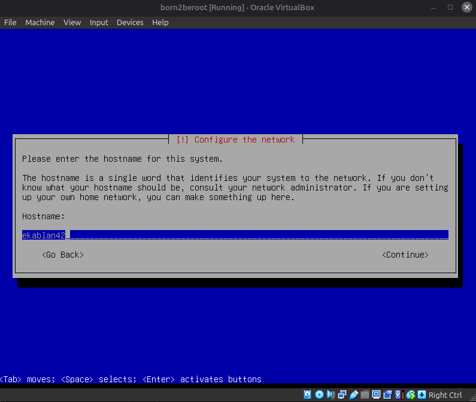

i didn't see any requirement for domain name on the project subject pdf. since our debian vm is a standalone local server, an external domain name is kinda unnecessary and the project subject only requires a specific hostname. so i left domain name empty.

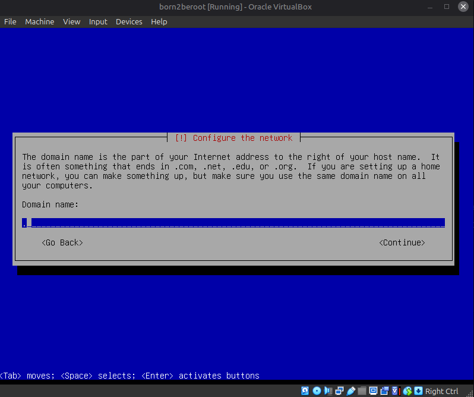

in the next page, the installer wants us to set a root password. i was told not to forget this password since we will be using this password later on. in case, note these kind of stuff all the time.

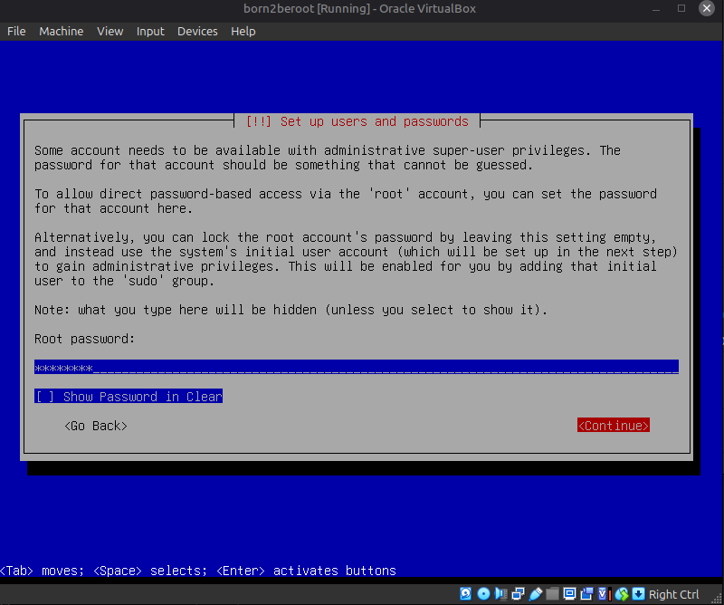

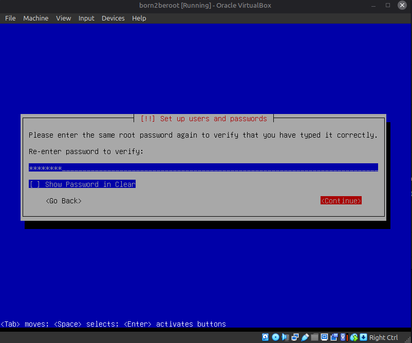

on the next pages, we are setting up users and passwords.

according to the project subject, user with our login as the username has to be present (we will make this user a member of user42 and sudo groups later on)

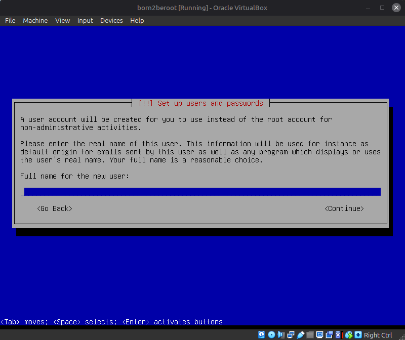

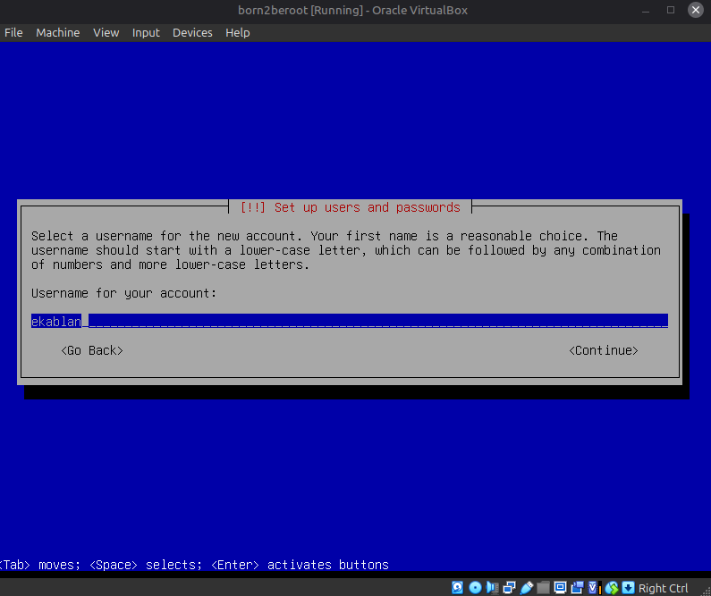

set a password for this user too. of course, do not forget this password either.

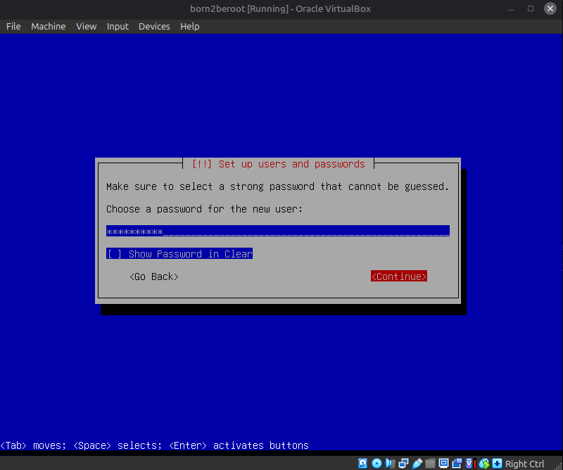

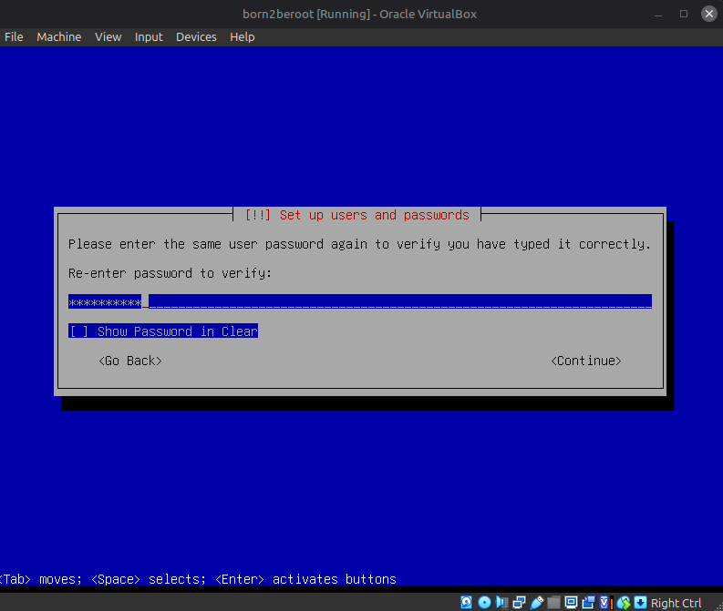

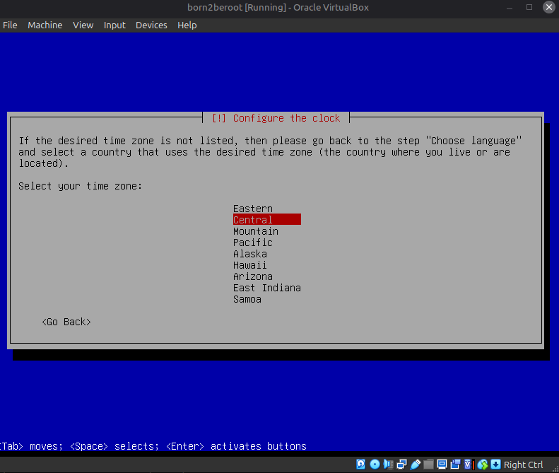

---

# Manuel Disk Partitioning

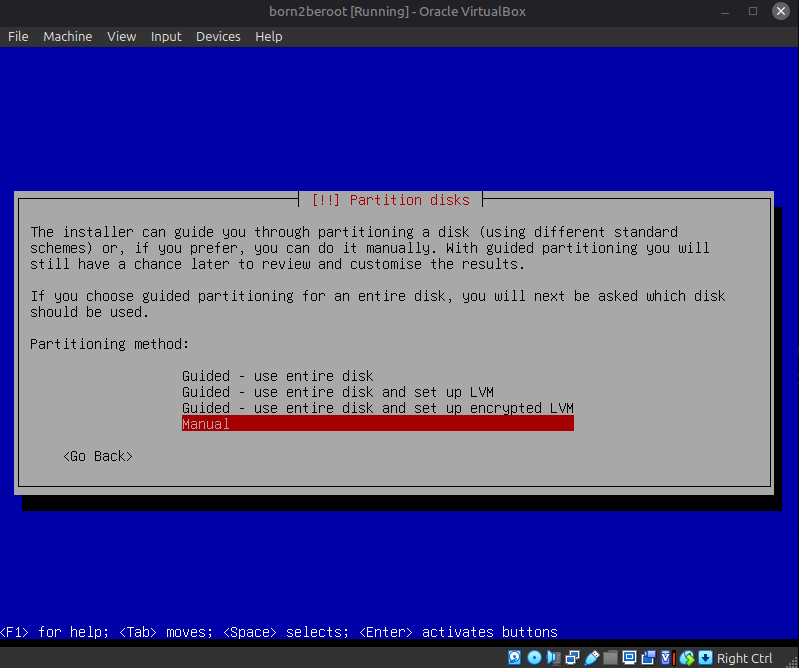

and then we are greeted by a disk management dashboard. we will choose which hard drive we want to modify. we are supposed to choose the middle one here since we are doing a %100 manual disk setup. 

by selecting 'SCSI3 (0,0,0) (sda) - 16.1 GB ATA VBOX HARDDISK', we are turning of the automatic installer to build the partition table, the /boot partition, the encryption layer and the LVM volymes ourselves.

'SCSI3 (0,0,0) (sda) - 16.1 GB ATA VBOX HARDDISK' represents our raw, empty VirtualBox hard drive. it currently has no partitions, no file systems and no data on it.

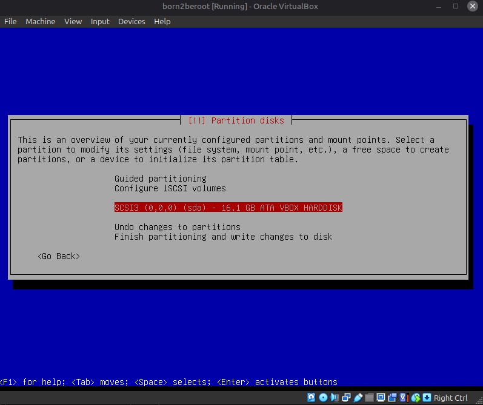

**-breakdown-** 

**SCSI3 (Small Computer System Interface Generation 3)** is a universal communication protocol used by operating systems to talk to storage drives. Generation 3 (SCSI-3) is the modernized standard that supports both parallel and serial storage controllers

most Linux kernels process almost all storage drives (whether SATA, SAS, or virtual drives) through a unified SCSI translation layer inside the kernel (called libata). even if VirtualBox uses a SATA controller, the installer sees and talks to it using SCSI command standards

**(0,0,0):** the hardware address numbers (adapter, bus, target/LUN ID) assigned to this disk on the virtual controller
    - Adapter: the virtual storage controller card plugged into your virtual motherboard??
    we only have one primary storage controller configured in our VM settings, so it gets index 0. if we added a secondary PCI storage controller card, its drives would start with Adapter 1
    - Bus: the internal data pathway (or channel) attached to that specific controller adapter.
    - Target / LUN ID: the specific device port number on the bus
        - LUN (Logical Unit Number): a sub-address used when a single physical storage target hosts multiple logical drives.
    virtualBox assigns your virtual disk (.vdi) to the very first storage port (Port 0) on the virtual controller. that's why the third value is 0

**(sda):** the linux device name.
    - **sd (SCSI disk)**: the standard Linux prefix used for all SCSI, SATA, and USB mass storage drives managed by the sd_mod kernel driver.
    - **a**: the first storage drive detected by the system. (a second drive would be sdb)

> when we partition sda, the kernel appends numbers to represent individual slices (for example sda1 is partition 1, sda5 is logical partition 5)

**ATA (Advanced Technology Attachment):** the standard physical storage bus interface emulated by VirtualBox. it allows the Debian installer to communicate with the virtual drive using standard, built-in disk drivers without requiring third-party software

**VBOX HARDDISK (Vendor and model identification string):** The hardware device model name generated by VirtualBox. VirtualBox hardcodes this vendor string so the operating system knows it is communicating with a VirtualBox virtual hard disk

**Other selections:**
- Guided partitioning: a shortcut back to the automated wizard screen you just left.
- Configure iSCSI volumes: an advanced tool to connect storage over a network interface. we are configuring a local virtual hard disk (.vdi) inside VirtualBox. not remote network storage. so skip this one too.
- Undo changes to partitions: a reset button that discards any changes, partition creations, or formatting choices made during the current installation session.

---

on the next page the installer asks to create new empty partition table. the whole time, the purpose was to create an empty table. ofc choose yes.

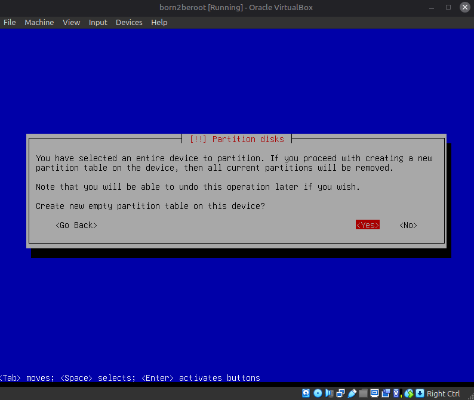

selecting pri/log (FREE SPACE) here launches the partition creation wizard.

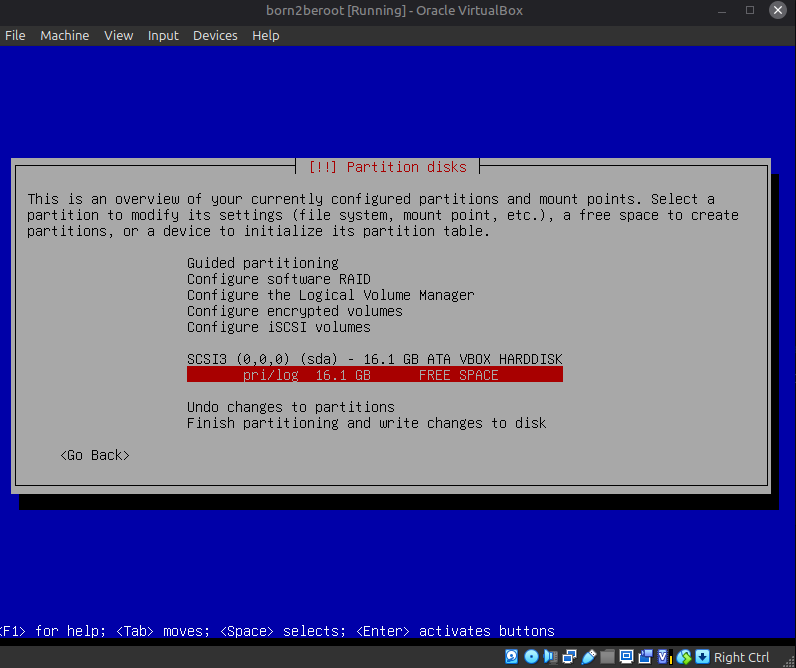

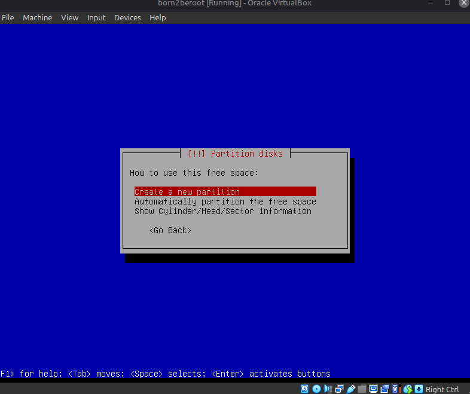

let's take a look at the given partition table example and fill out the new partition sizes according to the project subject:

> lsblk (list block devices) command displays detailed information about all available block devices such as hard drives, SSDs, USB drives and their respective partitions.

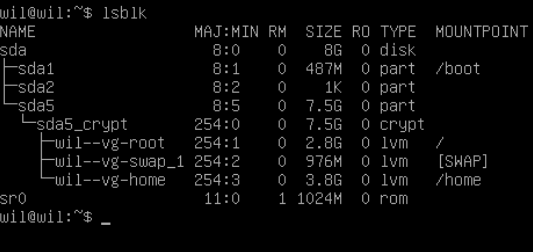

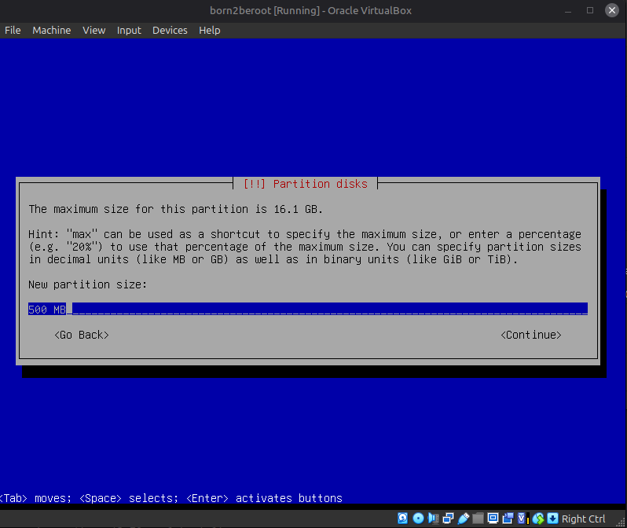

### Primary and Logical types for partitioning

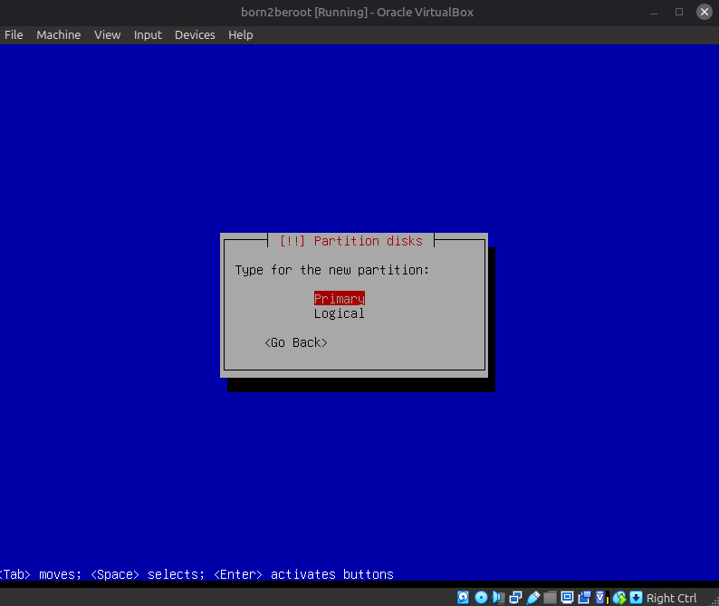

when using partition table on a hard drive, linux divides the disk using these two types:

- **Primary:** is the main partition on the disk. 
> an MBR (msdos) disk can have a max of 4 primary partitions.

```
Master Boot Record (MBR) is a tiny (512 byte) data structure at the very first sector (sector 0) of the hard drive.
msdos label : in linux tools like 'fdisk' or 'parted', partition table styles are given labels. MBR is called msdos because it was introduced with MS-DOS 2.0

~ partitions of MBR:

* 446 bytes (the boot code) - instructions that tell the BIOS where to find the bootloader
* 64 bytes (the partition table) - the index that defines where partitions start and end on the physical disk
* 2 bytes (boot signature) - identifies the sector as a valid boot record

the 512 byte limit comes down to the physical hardware design of hard drives when the MBR standard was created by IBM and microsoft in 1983. hard drives were manufactured so that the smallest addressable unit of physical storage on the magnetic platter (called a sector) was hardcoded to 512 bytes. when a computer powered on, the IBM PC BIOS (Basic Input/Output System - low-level firmware) was hardcoded to read only Sector 0 (the very first 512-byte block on the drive) into system RAM and execute it

BIOS (BAsic Input/Output System) is a low-level firmware. it is the fundamental software stored on a chip on the motherboard that wakes up the hardware when you press the power button and hands control over to the operating system
```

> primary type is used for critical system startup files (like /boot). the BIOS and bootloader (GRUB) can read Primary partitions directly to start the operating system.

- **Logical:** A sub-partition created inside a special Primary partition called an Extended Partition.
> it bypasses the 4-partition limit, allowing you to create extra partitions.

> used for extra data storage or additional system drives when you run out of primary slots.

Setting /boot as a Primary partition at the 'Beginning' (front) of the disk ensures the GRUB (bootloader) can locate and read the boot files cleanly before any complex drivers are loaded.

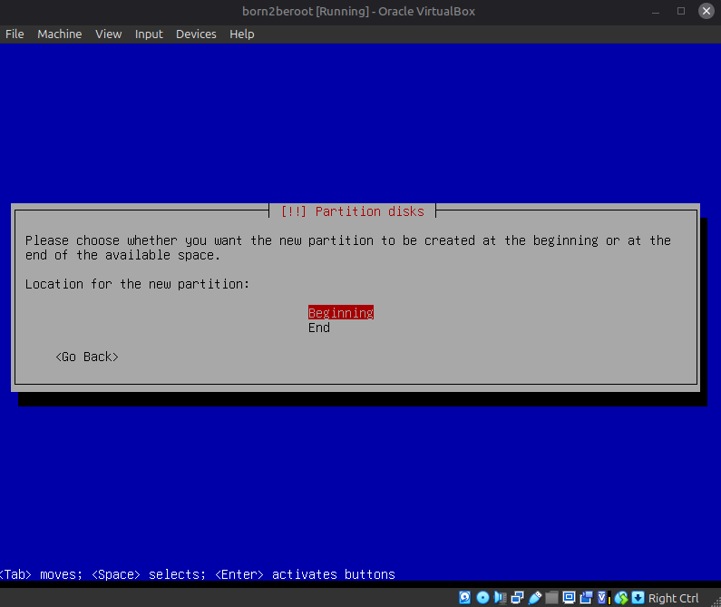

> **Bootloader**: a bootloader (like GRUB) is the very first program that runs when you power on a computer. its main job is to locate the operating system kernel, load it into system memory (RAM), and start it.

'End' is typically used for non-urgent partitions.

following screen shows us the details of the partition. We will modify the mount point according to the project subject.

---

> What is 'mounting'?

    The process of attaching a disk partition (or USB drive) to the operating system so Linux can read and write data to it

> What is 'mount point'?

    the specific folder used as the entry door to access that mounted disk space.

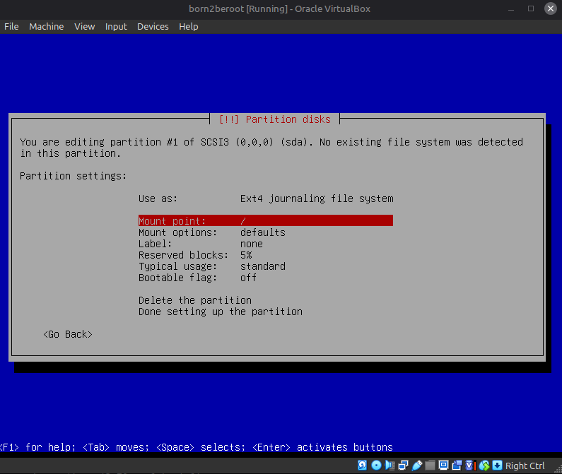

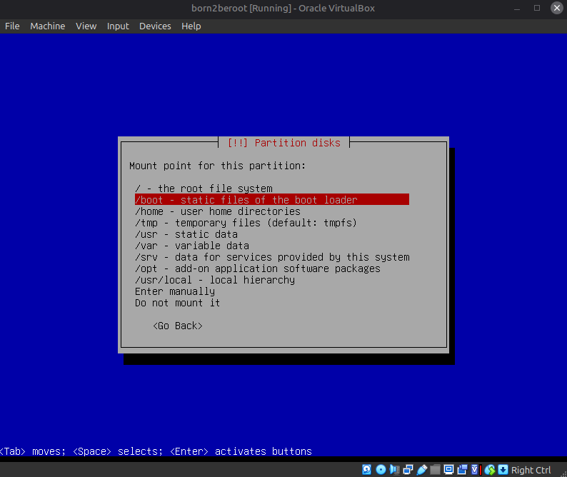

we are not going to modify any other settings:

- _**Use as:** Ext4 journaling file system :_ defines how data is formatted and organized on the partition, Ext4 is the standart for linux file system, GRUB and linux kernel fully support reading Ext4 without needing any extra drivers, so leave it as it is.

- _**Mount options:** defaults :_ sets system permissions and behaviors (read-write access, executing binaries) when mounting the partition. _defaults_ includes all basic r/w flags required.

- _**Label:** none :_ an optional text name assigned to the drive volume for identification. Linux uses device names (/dev/sda1) internally, custom labels are for nothing but styling it. unnecessary here.

- _**Reserved blocks:** 5% :_ keeps 5% (25 mb for this specific partition) of the partition's space locked for the root user to prevent complete system lockup if a disk fills up to 100%. it is a built-in kernel safety net. this setting ensures that the root user can still log in and run emergency cleanup commands if a normal user or daemon accidentally fills 100% of the available user disk space.
    > **daemon:** deamons start automatically when the system boots and run quietly behind the scenes without opening a terminal/user interface. in Linux, daemons usually end with a 'd' (crond, systemd, sshd etc.). daemons can handle system monitoring, listen for incoming network connections, write logs, or manage hardware devices.

- _**Typical usage:** standart :_ adjusts how many files can exist on the disk. standart is optimized for normal file and directories. /boot only holds a handful of large kernel image files, standart works for us here.

- _**Bootable flag:** off :_ a legacy MBR flag used by older PC systems to decide which partitions to read first. modern GRUB bootloaders on linux ignore this flag because GRUB is installed directly into the Master Boot Record (MBR) sector at the front of sda

once we are done with the partition settings, the partition will appear on the partition table.

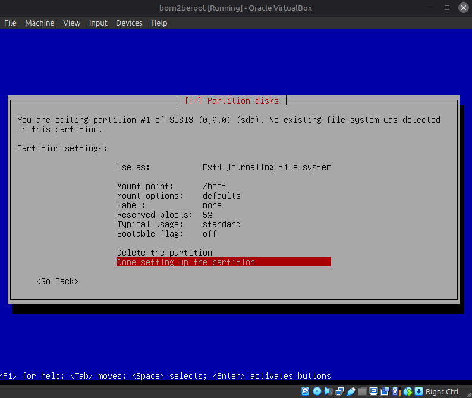

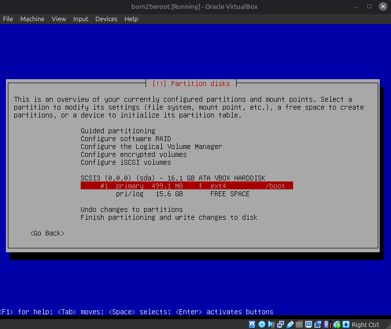

The born2beRoot subject requirement states: "You must create at least 2 encrypted partitions using LVM."

> **An encrypted partition** is a physical or logical disk area where all raw data is mathematically scrambled using a cryptographic algorithm (LUKS/AES in Linux). Without entering the correct password at boot to decrpyt it, the data remains unreadable to anyone pulling the hard drive out.

> **LVM (Logical Volume Manager)** is a storage abstraction layer in Linux that allows you to manage disk space flexibly. in traditional partitioning, we devide a physical hard drive directly into fixed partitions (like sda1 in my project), which are difficult to resize or extend. LVM places a management layer between physical disks and the file systems, letting you treat disk space flexibly.

- sda5 is the physical partition on disk
- sda_crypt is the decrypted container unlocked by your password
- wil--vg-root, wil--vg-swap_1, and wil--vg-home are individual encrypted logical volumes inside that single decrypted container.


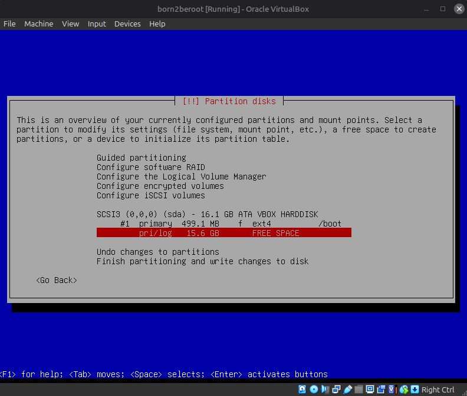


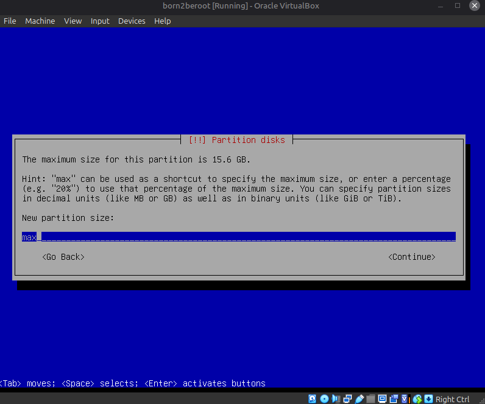

on an MBR disk, primary partition numbers are reserved for slots 1 to 4 (sda1/2/3/4)

logical partitions are created inside an Extended partition (which takes up one of those primary slots, like sda2).
means:
- sda1 is our Primary (/boot) partition
- sda5 is our first Logical partition, placed right after sda1
- sda2 is the Extended container holding the logical space

We reserve and use Logical partitions for any scenario where you need more than 4 total partitions on a traditional MBR disk, or when you want to isolate non-critical user and system data away from the main primary boot files.

```
primary partitions are limited to 4, because the partition table in the MBR header is 64 bytes long, and each partition entry requires 16 bytes of metadata:

1 byte (boot flag) : indicates if the partition is active/bootable
3 bytes (CHS start address) : the starting cylinder, head, and sector of the partition
1 byte (partition type) : 
3 types (CHS end address) : the ending Cylinder, Head, and Sector of the partition
4 bytes (LBA start sector) : the starting sector number of the partition using modern LBA (logical block addressing)
4 bytes (total sectors) : the total count of 512 byte sectors contained inside the partition

using 32 bits, the maximum number of sectors an MBR partition table can count is

2^32 = 4,294,967,296

since each sector is 512 bytes, multiplying the maximum sectors by sector size gives the hard limit:

4,294,967,296 * 512 bytes = 2,199,023,255,552 bytes approx. = 2.19 TB

```

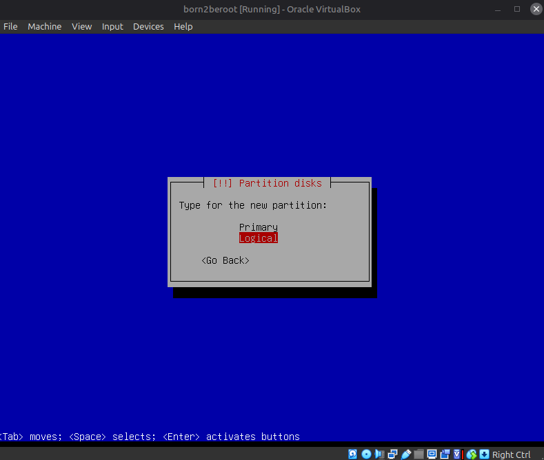

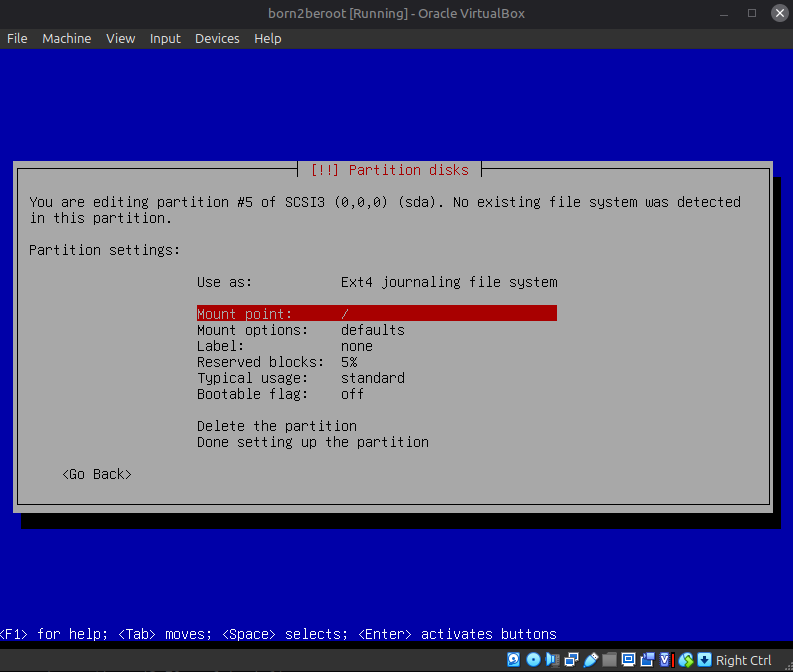

sda5 is a raw container and its job is encryption. it will serve as the raw physical host for our encrypted container. the actual file systems and mount points will be created inside the LVM volumes that sit on top of this encrypted layer.

> **encryption** is a fundamental security mechanism that is the mathematical process of scrambling plain text or raw disk data into an unreadable format (ciphertext) using a secret cryptographic key. its core purpose is to ensure data confidentiality so that even if an unauthorized person, hacker, or thief gains access to the underlying storage drive or network stream, the data remains completely unreadable and useless to them without the correct decryption key or passphrase

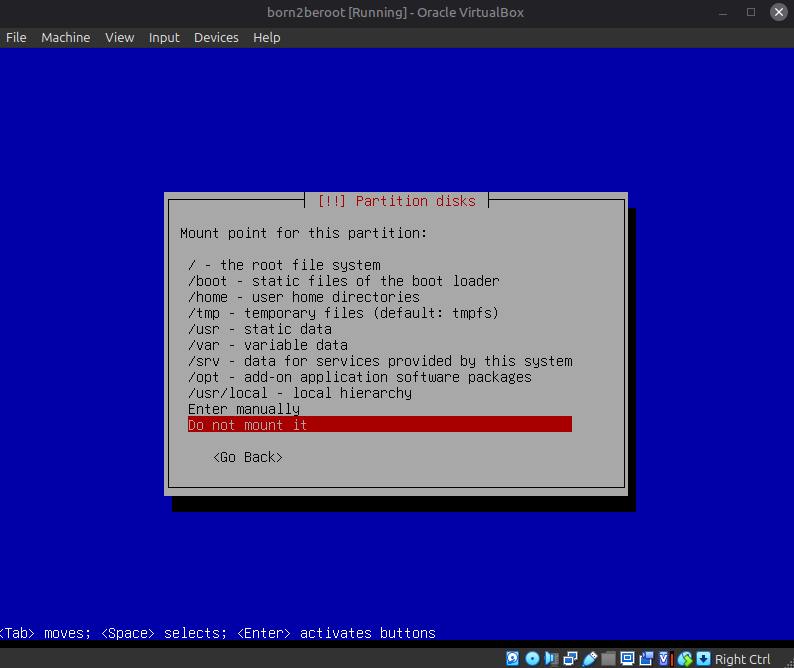

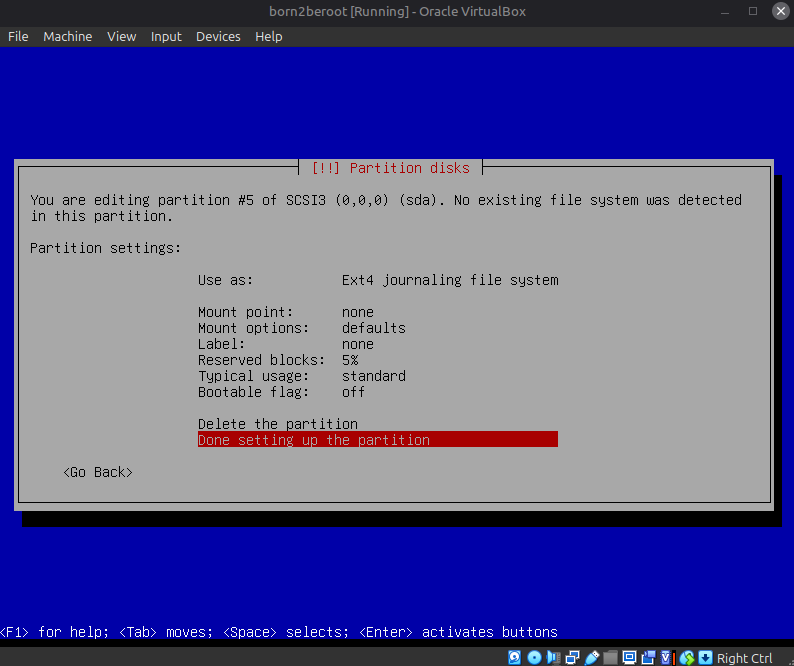

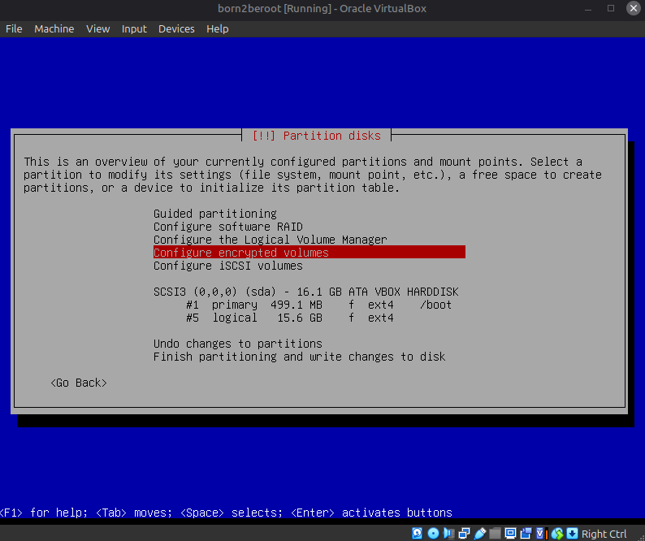

we will be using LUKS (Linux Unified Key Setup) as the encryption tool. Linux kernel cannot build an encrypted LUKS container on top of a partition that does not technically exist on the physical drive yet.

> LUKS is the standard specification for full-disk encryption in Linux.

> Symmetric Encryption (LUKS / AES-256): used for your encrypted disk (sda5_crypt). the same secret passphrase is used both `to lock (encrypt)` and `unlock (decrypt)` the hard drive.

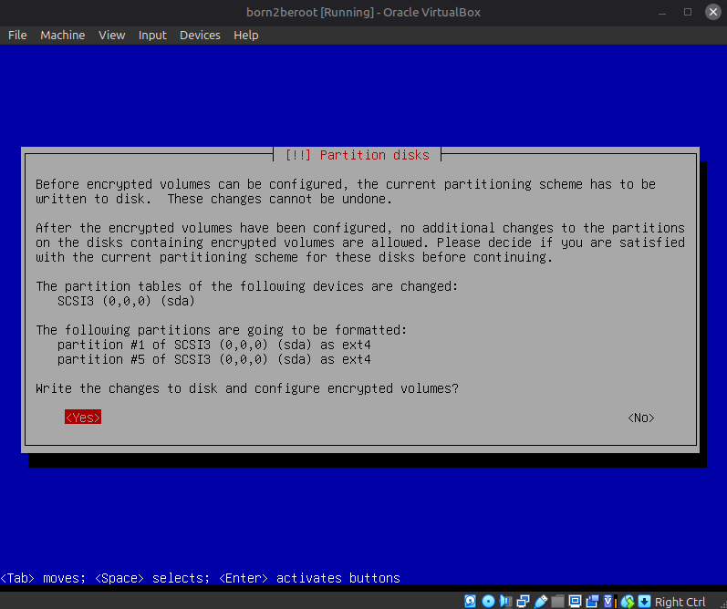

now we can create the encrypted volumes:

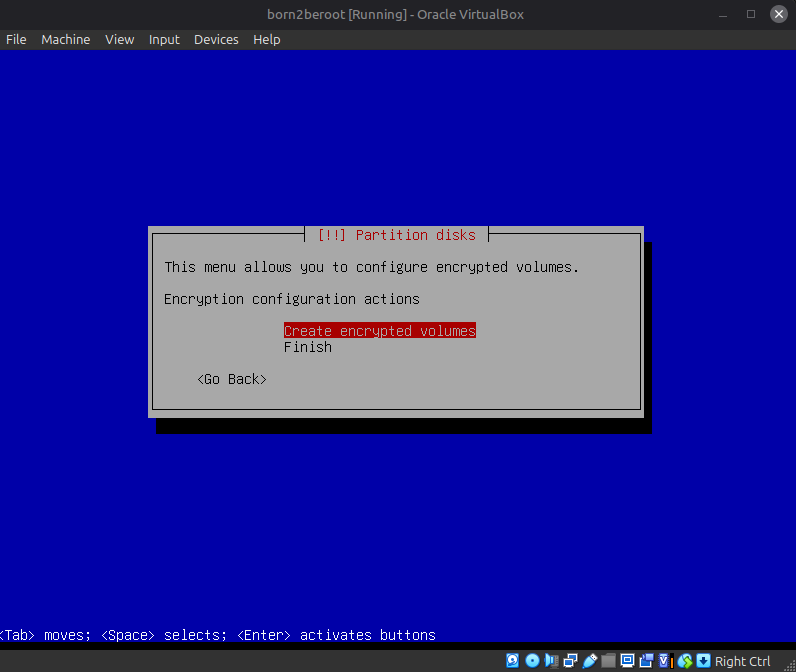

select the partition you want to perform the encryption on. we better not select sda1 (/boot), because when our computer turns on and the bootloader is loaded, GRUB needs to read the Linux kernel and initial RAM disk from /boot to start the operating system

or

if /boot is encrypted, GRUB itself must contain the LUKS decryption drivers to prompt us for a password before the linux kernel is even loaded, which is too complicated to be worth it. 

and

standart Linux architecture requires the standart design pattern across Linux distibutions is to keep a _small_, _unencrypted_ /boot partition so that GRUB can easily hand control over the kernel. the kernel handles prompting for the passphrase and decrypting the rest of the disk (which will be sda5_crypt in our project)

and select 'Continue'
 
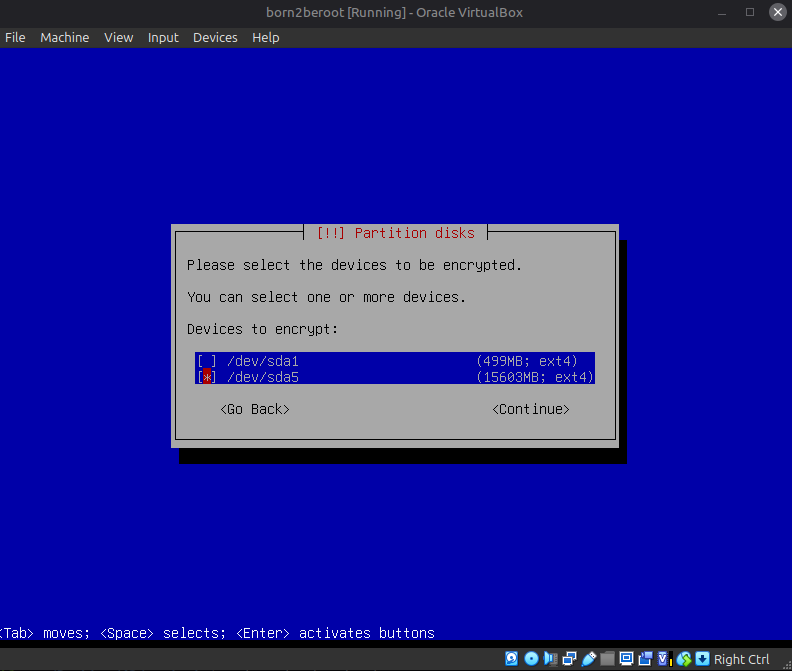

select 'Done setting up the partition'

leave the remaining settings as it is:
- Use as: physical volume for encryption (neat as day)
- Encryption method: Device-mapper (dm-crypt) --> is a tool in the Linux system that locks and hides data on hard drives so people cannot read it without the correct password. Often works with LUKS.
- Mount point: none --> an encrypted raw partition is simply a locked box (dm-crypt container). it doesn't contain a filesystem like Ext4 that Linux can attach to a folder directory. Leaving Mount point as none is mandatory so the installer knows to treat this partition purely as an encrypted container for LVM, rather than trying to mount it directly to the system
- Mount options: defaults --> this option applies to how filesystem flags (dev, auto, exec, async, suid, rw etc.) are passed when mounting. Because this raw partition isn't being mounted directly, altering mount options here has no functional effect on the setup.
- Encryption: aes, Key size: 256 --> AES-256 is the current standart for symmetric encription. provides maximum data protection.
- IV algorithm: xts-plain64 --> XTS is the recommended Cipher Block Chaining mode specifically designed for full-disk encryption. Selecting older initialization vector (IV) modes like cbc-essiv might lead to make the volume more vulnerable to targeted cryptographic attacks
- Encryption key: Passphrase --> this tells LUKS to prompt you for a password when booting up the virtual machine
- Erase data: yes --> keeping it as 'yes' hides the real data volume. An attacker looking at the drive won't be able to tell where your actual files end and where empty space begins. it will all look like random noise. It erases any leftover traces of old files that were on the disk before. you can save about 1–2 minutes during installation. however, old data remnants might stay on the drive, and an attacker can see exactly how much real data you actually have stored inside the encrypted container.
- Bootable flag: off --> label that tells your computer's motherboard to start the computer from the specified partition. the system cannot directly start from and encrypted partition because it can't read the files inside without the password first. it won't work anyway if we set it to 'on'

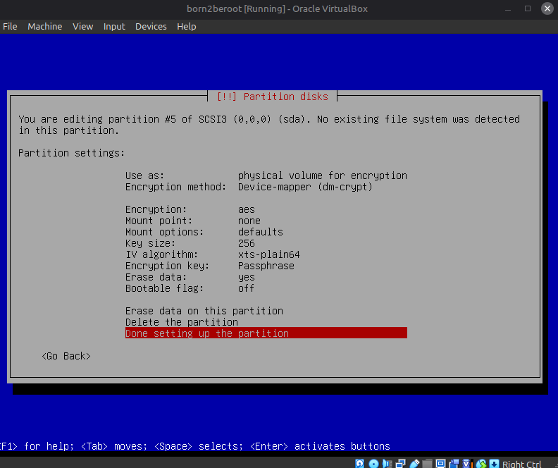

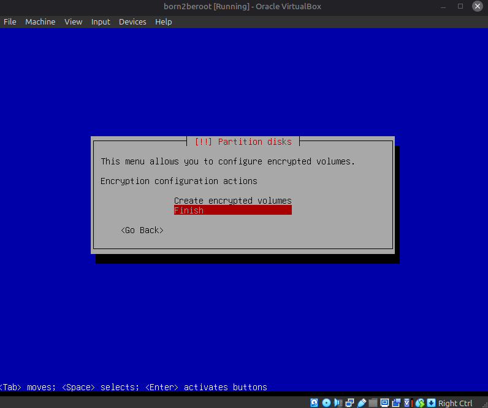

The following screen is asking if you want to fill your new encrypted partition with random data before formatting it with LUKS. when preparing an encrypted volume, the installer offers to overwrite the entire partition space with random noise (0s and 1s). filling the partition with random noise prevents attackers from inspecting the raw drive later to tell the difference between actual encrypted files and unused empty space. 

might take a few minutes to finish

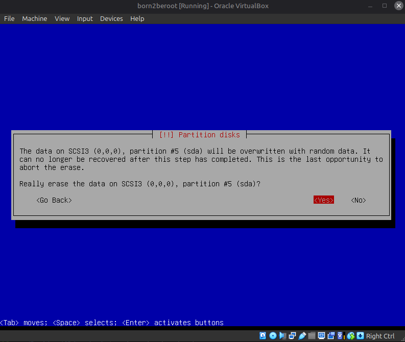

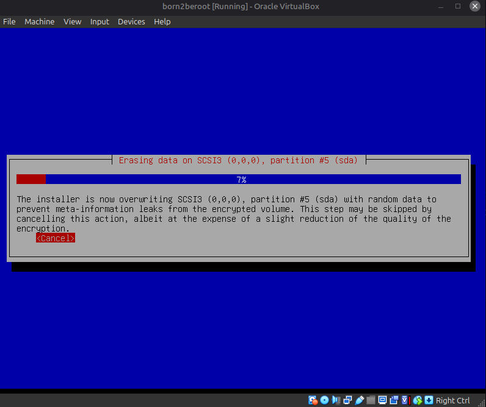

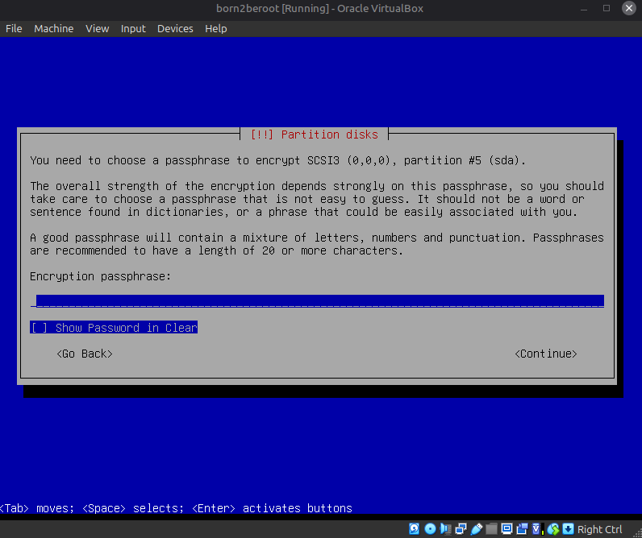

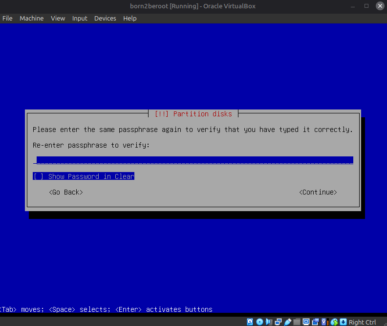

to sum up,

- after setting up /boot (sda1), we selected the remaining FREE SPACE and assigned the max size.
- when asked for the partition type, we chose Logical

--> the moment we chose Logical, Debian automatically named that 5th partition slot as 'sda5' on disk.

- immediately after, we went into 'Configure encrypted volumes' and set a passphrase

--> Debian took that raw sda5 partition, applied the LUKS encryption layer on top of it, and mapped the decrypted, unlocked container as sda5_crypt.

sda5 : the raw physical partition on the virtual disk

sda5_crypt : the unlocked, decrypted container that sits on top of sda5 for LVM to use 

## Configuring the Logical Volume Manager

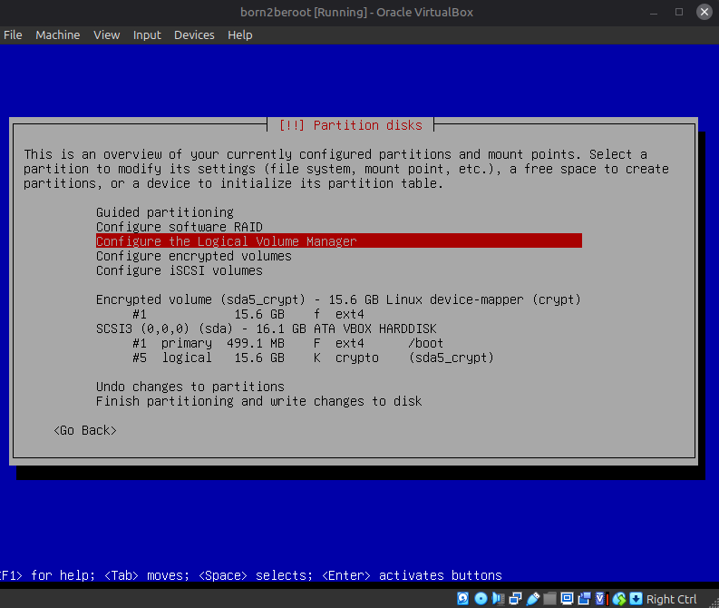

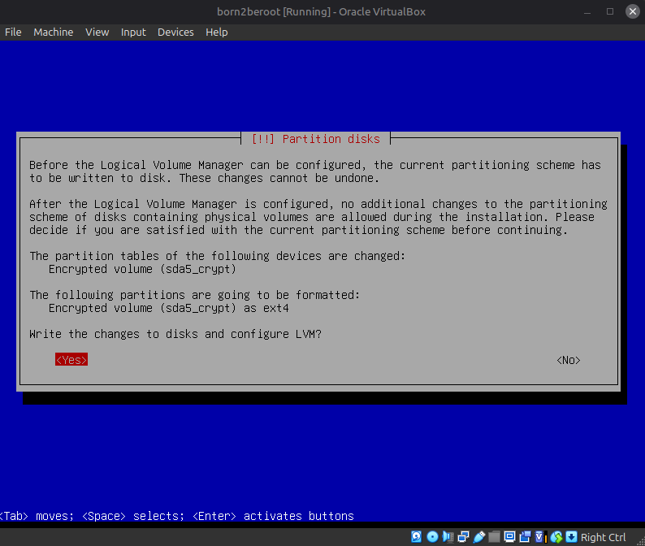

finally, sda_5crypt is sitting physically and ready as an encrypted storage space.

and now, it's time to create logical volumes. before that, we need to create a volume group that holds the logical volumes. because, we cannot create logical volumes directly on a physical volume. lvm architecture enforces that logical volumes must live inside a volume group.

--> the volume group abstracts the raw disk space. instead of dealing with fixed physical boundaries, the volume groups turn sda5_crypt into a continuous pool of storage blocks (extends) that you can allocate, shrink, or expand dynamically. 

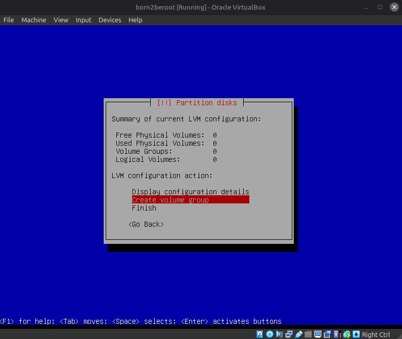


Linux device mapper automatically replaces single hyphens with (-) double hyphens (--) in the system path diplay. and seperates the volume group name and the logical volume names with a (-). we can modify the volume group name later anyway.


/dev/mapper/sda5_crypt is our encrypted storage protected by LUKS. by building the volume group inside it, every logical volume we create automatically becomes encrypted


## Configuring Logical Volumes


repeat the same thing for all of the logical volumes shown in the mandatory partition table.


we can also see that instead of a drawing nested tree, we see each virtual device block seperately. the reason they appear as seperate top level blocks in this interface is simply because of how the Debian installer renders different device-mapper devices.

> a device-mapper device is a virtual storage layer created by kernel

instead of writing data directly to a physical hard drive, Linux uses the Device Mapper framework to pass data through virtual translations (like encryption or logical volume management) before it touches the physical disk.

every time we add a virtual layer on top of our raw disk (sda), Linux creates a new device-mapper device under /dev/mapper/. in our setup, we have 4 device-mapper devices running.

physical disk itself (sda5) ---> not a device mapper device.
    /dev/mapper/sda5_crypt  ---> device-mapper device #1 (LUKS encryption layer)
        volume group (LVMGroup)
            /dev/mapper/LVMGroup-root ---> device-mapper device #2
            /dev/mapper/LVMGroup-swap_1 ---> device-mapper device #3
            /dev/mapper/LVMGroup-home ---> device-mapper device #4

for the next step, we are supposed to configure all of them since we only created an empty, unformatted slice of space so far. the installer needs to know how to format it and where to attach it in the system


we select Ext4 for home (and also for root). without choosing a file system like ext4, Linux just sees LV home as a raw block of 4.0 GB of empty noise and cannot write any files or directories inside it


now repeat the same process for all of the other logical volumes except swap.

swap --> 'Use as: swap area'


on the next screen, Debian's installer asks us if we have any secondary ISO files. i prefer to download all additional packages (sudo, ufw, openssh-server etc.) required for the project from the internet over the debian network. i will skip this step.


it does not change anything but download speed for our project. choosing the archive mirror country simply determines which server location your package manager (apt) connects to when downloading tools.


**deb.debian.org** is the official default recommended by Debian. it automatically picks the fastes working server for you. additionally, if local regional servers go down, it instantly switches to a backup server so it never fails. 


Debian's installer asks us if we want to add a HTTP proxy. we want to connect directly to the internet. home internet and 42 campus networks allow direct connections, so no proxy information is needed here. just leave it as it is and continue.


i had an error at this point. the reason might be the virtual machine lost internet connection or couldn't resolve the DNS address for deb.debian.org. i hit 'Go Back'


configure package managers > rejected extra installation > choose Turkiye > select ftp.tr.debian.org > leave the HTTP proxy information empty

and waited for a few minutes for installations

since we are doing our best to minimize background processes, cron jobs and unnecessary network traffic as born2beroot requires, we better say 'no'


on the next step we will uncheck all of the selected softwares

- unchecked web server because the mandatory part does not require a web server and i don't intent to complete the bonus section. 
- unchecked SSH server, because it comes with pre-configures defaults. the installer automatically configures openssh-server to run on default port 22. but the project requires SSH to run on port 4242, with root login disabled for security reasons, and managed behind ufw.
- checking other debian desktop environments installs a heavy desktop interface with windows, icons, and a mouse pointer. as the project subject indicates, installing GUI violates the project requirements and will result in an immediate fail


as we mentioned previously, GRUB (Grand Unified Bootloader) is the first program that runs when the virtual machine boots up. it locates the Linux kernel on the drive, initializes the LUKS decryption process, and loads Debian into memory. without installing GRUB to our primary drive, our vm will have no instructions on how to start the operating system, resulting in a "no bootable device found" error on startup.


# Virtual Machine Configuration

after the installation setup, we'll see GRUB Bootloader menu.

then we are greeted by the LUKS disk decryption prompt. pass the passphrase you previously set up.


enter non-root user credentials


## installing 'sudo'

i'll start with installing sudo, we must be root before attempting to install sudo

logging in as root continuously is dangerous. one wrong command can instantly wipe or break the system. we install sudo so that normal users can safely perform administrative tasks without having to log in directly as root every time.

we can use `su` command. this command switches the user identity to 'root' which might be risky for me at this point because i don't know where the system administrative tools. using 'su' makes you remain in the regular user's directory (/home/ekablan) and keeps your normal user's environment variables (like $PATH, home directory, and configuration files)

i could probably get confused at some point.

i preferred `su -` because it performs full login shell as root. completely loads root's environment variables, resets the $PATH variable to include system administration paths, and changes your current directory to /root. provides a clean, isolated environment guaranteed to locate administrative tools.

we will use apt to install sudo. apt (Advanced Package Tool) is a package management system that is pre-installed by default as part of the Debian installation. we can use apt to handle installation and removal of software on Debian and Debian-based linux distributions.

fetch the latest package repository lists

`apt update`

install the sudo package:

`apt install sudo`


verify whether sudo is installed or not:
`dpkg -l | grep sudo`


- **dpkg (Debian Package manager):** the core low-level tool in debian used to manage, install, remove and query .deb package files on the system.

- **| (pipe symbol):** takes the standart output (the list of packages produced by dpkg -l) and passes it directly as input into the next command, rather than printing the entire list onto your screen.

- **grep sudo:** grep (Global Regular Expression Print) is a search tool that scans incoming text line by line and filters out only the lines that match a specific pattern (sudo)

in the output, we can see sudo is installed _**(ii)**_

>the first letter (i) represents the 'desired package state'. i stands for 'install'
- other desired package states: u (unknown), r (remove/deinstall), p (purge), h (hold)

> the second letter (i) represents the 'current package state'. i stands for 'installed'.
- other current package states: n (not installed), c (config files), U (unpacked), F (half configured - failed), h (half installed - failed), W (triggers-awaited : package is waiting for a triggger), t (triggers-pending : package has been triggered)

## adding user to sudo group

according to the subject, the user has to belong to user42 and sudo groups

we don't need to create a sudo group additionally, the installation script automatically created the sudo group in the system files when we installed the sudo package. after adding the user to sudo group, i checked which users belong to sudo group.


> **adduser** and **getent** are fundamental linux administration tools used for managing user accounts.

- **adduser:** a high-level interactive command-line tool used to create a new user account on the system. can be used also for adding existing users to an existing group. (`adduser ekablan sudo`)

- **getent:** short for 'get entry'. it fetches records from linux administrative databases (defined in /etc/nsswitch.conf) such as users, groups, or network hosts

this line indicates that every user assigned to the sudo group, inherits full administrative permission:


this line gives all we want, we don't need to add ekablan user under the '# User privilege specification' anymore.


i ran `groups` to verify if the active shell session reflected the new sudo group membership.


it doesn't show sudo. 

> the underlying reason is: when we logged in (ekablan), Linux created a session 'permission token' in RAM based on /etc/group at that moment. adding ekablan to the sudo group updated the /etc/group file on the hard drive, but our running shell session was still using the old token cached in memory.commands like 'groups' check the session's memory token, which is why sudo wouldn't show up.

i tried re-authenticating to my session.


This command was meant to open a fresh shell session as the current user 'ekablan' with updated group permissions. but it didn't work. idk why

decided rebooting since it is the cleanest definitive solution. rebooting saves the changes to the disk. any files, installed packages, modified configurations etc are written directly to the disk when rebooting. use `reboot`

but it got stuck for like 5 minutes

so i gave up waiting and power off the machine and than started it again. worked. didn't question it and moved on.

after rebooting, i logged back in as ekablan and ran `groups`. sudo group now appeared in the output, confirming that the new session security token successfully loaded the updated group permissions from disk:


> **additional note:** even before rebooting, running `sudo whoami` returned 'root' because sudo reads group memberships directly from disk (/etc/group) on execution. however, rebooting was necessary to refresh the shell's session memory token so that standard commands like groups also recognize the updated membership

## getting SSH service

the project subject indicates that there must be an SSH service

### What is SSH?

**SSH (Secure Shell)** is a secure and encrypted network protocol that allows you to connect to and manage a remote computer or server via the command line.

it encrypts all username, password, and command data sent over the internet or a local network. this ensures that even a third party intercepts the data, they cannot read it as plain text.

#### What is SSH Service (SSH Daemon / sshd)?

the ssh service (sshd / OpenSSH server on Linux) is a program running continously in the background of a server that listens for incoming SSH connection requests. means, to connect to a server via SSH, an SSH service must be installed and actively running on that target server.

rules such as which port the SSH service listens on or whether root login is allowed are configured in the `/etc/ssh/sshd_config` file

#### What is port?

a port is a virtual gateway (like a network slot number) used by network services running on a computer to communicate with the outside world. 

while a computer's address on a network is its IP address, the port number (ranging 0 to 65535) determines which specific application or service on that computer receives the data.

---

`sudo apt install openssh-server -y`

and check if it is exists on the system

`dpkg -l | grep ssh`


by running `sudo systemctl status <service_name>`, we can check health, active state, and operational logs of any background program managed by the system.

#### What is systemctl?

modern Linux distributions like debian use an init system and service manager called systemd. systemd is the very first process that runs when your linux kernel boots up (it gets process ID 1). it is responsible for bringing up the entire system, mounting file systems, managing hardware events, and launching background services. **systemctl** is the dedicated command-line utility used to communicate with and send instructions to the systemd process manager. simply, systemctl is the remote control for the operating system's background programs (services/daemons). it lets us start, stop, enable, disable, and check the status of these services.


already active but if needed we can start the service with the following command-line:

`sudo systemctl start ssh`

other useful commands:

`sudo systemctl stop ssh` : closing active remote connections, stops listening on network ports etc.

`sudo systemctl reload ssh` : re-reads configuration files without terminating existing active client connections. we will use this command whenever we modify the ssh configuration file (/etc/ssh/sshd_config) to apply the changes. we can use **reload** when we edit the ssh port or disable root login so we don't risk getting kicked out of an active ssh session

`sudo systemctl restart ssh` : required when updating core binary packages, fixing broken service state or when reload isn't supported.

`sudo systemctl enable ssh` : configures systemd to launch SSH automatically every time the virtual machine boots up

`sudo systemctl disable ssh` : prevents ssh starting from automatically on system startup

### Configuring SSH

the project subject indicates:

- [x] must be running on port 4242
- [x] must not be possible to connect using SSH as root for security reasons

open the SSH configuration file: `sudo nano /etc/ssh/sshd_config`

> find '#Port 22' line and remove '#' and change it as _**'Port 4242'**_

> find 'PermitRootLogin prohibit-password' and remove '#" and change it as _**'PermitRootLogin no'**_

ctrl + O > enter > ctrl + X


checked the listening port with `sudo systemctl status ssh`, server was listening on port 22. ran `sudo systemctl restart ssh`. checked again:


## Installing and Configuring UFW

#### What is firewall?
a firewall is a security guard for your computer's network connection. without a firewall, every port is open to anyone on the internet. a firewall checks every piece of incoming and outgoing network traffic, and enforces strict rules like 'port 4242 is allowed in but block every other port'

### What is UFW? 
UFW (uncomplicated firewall) is a simplified remote control for the linux kernel's built-in firewall. under the hood, linux uses a very complex and powerful security engine (nftables or iptables). configuring it directly requires writing looong and complicated syntax. ufw acts as a friendly wrapper so you don't have to deal with complexity.

run `sudo apt install ufw`

verify installation via `dpkg -l | grep ufw`


checked whether it is enabled


i have found out that we cannot use systemctl for enabling ufw. systemctl only controls whether the program loads when the computer turns on. running `sudo systemctl enable ufw` only loads the program. but ufw stays in 'inactive' mode and lets all traffic through anyway. 

we should use ufw command (the official tool that comes directly with the installation of the UFW package). `sudo ufw enable` turns it active and automatically configures systemctl to start it on boot for us 


the subject indicates only leave port 4242 open.


let's try to connect to our vm via our terminal:

Oracle VirtualBox Menu > Settings > Network


hit 'Port Forwarding'


we will fill in the 'Host Port' and 'Guest Port' sections

- Guest port (4242): defines which port inside the vm accepts the connection (where sshd is listening)
> since the vm runs inside an isolated NAT network, your host computer's terminal has no direct way to locate the VM's internal IP address. Setting the Guest Port to 4242 acts as the internal target for VirtualBox's network bridge, directing traffic received at the host's outer boundary directly into Debian's listening SSH service on port 4242
- Host port (4242): defines which port on our physical computer receives the terminal connection
- by leaving IP field blank, VirtualBox defaults to listening on all local interfaces (127.0.0.1 / 0.0.0.0) and automatically routes the traffic directly to the vm's active virtual network interface

> **NAT** :


i used 4242 as both Host and Guest ports so that i don't have to remember two different port numbers :):):):):) 

you can decide on any port available


```
it may cause a confliction issue if 4242 port is already in use on your system.

run `nmap` against `localhost` to scan for open ports and verified which services are listening.

`sudo nmap localhost -p-`
```

and hit ok and turn back to vm.

even though a reboot isn't needed for the changes to function now, let's test if our ssh service and ufw firewall automatically start up on boot without manual intervention. confirming it now seems healthier before moving for the next section

run `sudo reboot`

and


both services are active and functioning.

i observed that

> ssh displays active (running) because it maintains a persistent listener daemon. long-running services (like ssh) must run a continuous process in memory to listen for incoming connections instantly.

> ufw displays active (exited) because ufw is a configuration script, not a continuous process. On boot, systemd runs the ufw script, which loads the firewall rules directly into the kernel memory. once the kernel has the rules, the script finishes its job and exits. 

## Connecting to the vm

open your terminal on your pc

run `ssh -p <host_port> <ekablann>@127.0.0.1`

because our vm uses NAT mode, its internal IP address lives inside an isolated virtual network created by VirtualBox. our physical host computer cannot reach that address directly. instead, we instructed VirtualBox to open port 4242 on localhost.

> localhost (or the ip address 127.0.0.1) refers to our physical computer itself.


## Sudo Configuration

now we are supposed to configure strict security rules for the sudo group to secure administrative privileges on the system.

we need to edit /etc/sudoers configuration file to achieve this.

/etc/sudoers controls user permissions and global sudo settings.

we will use 'visudo' to edit this file. visudo is the official administrative tool used to safely edit the /etc/sudoers.

the reason we are not using a standard text editor such as nano or vim is,

if you edit /etc/sudoers with a normal text editor and make a single syntax error or typo, you can completely lock yourself out of administrative access and you will need to reboot into recovery mode and edit the kernel parameters to launch the root shell and repair the file manually. unnecessary headache due to a minor mistake.

whereas 'visudo' prevents this completely. visudo opens /etc/sudoers in a temporary buffer file. when we save and exit, it runs a syntax check before writing any changes to the real file. if it detects a syntax error or typo, it warns you with a prompt and refuses to save the broken config 

run `sudo visudo`

added the required directives to the /etc/sudoers as the subject indicates,

- Authentication using sudo has to be limited to 3 attempts in the event of an incorrect password.

`Defaults passwd_tries=3`

> Defaults keyword is a directive used in /etc/sudoers to set system-wide default behavior for the sudo command

```
 ~ Other usages of 'Defaults' keyword ~

user-specific Defaults --> Defaults:ekablan passwd_tries = 4
group-specific Defaults --> Defaults:%sudo !authenticate (runs commands without prompting for a password)
host-specific Defaults --> Defaults@server1 (can be used if sharing one sudoers file across multiple servers)
command-specific Defaults --> Defaults>/sbin/reboot !log_output (disables output logging when running /sbin/reboot) 

```

- A custom message of your choice has to be displayed if an incorrect password is entered when using sudo.

`Defaults badpass_message="<message>"`

- Each action performed with sudo has to be logged, including both inputs and outputs. The log file has to be saved in the /var/log/sudo/ folder.

`Defaults log_input, log_output`

`Defaults logfile="/var/log/sudo/sudo.log"`

- The TTY mode has to be enabled for security reasons.

`Defaults requiretty`

> TTY refers to a terminal session. web servers, background cron jobs, or automated daemons run in non-TTY environments. if an attacker manages to inject a malicious command through a web application or background service, requrietty prevents them from escalating privileges via sudo. simply, requiretty guarantees that every sudo command is tied directly to a real user logged into an active terminal session.

- For security reasons, the paths that can be used by sudo must also be restricted.
Example:
/usr/local/sbin:/usr/local/bin:/usr/sbin:/usr/bin:/sbin:/bin:/snap/bin

> this requirement means sudo will only look for commands in those specific folders and will ignore everywhere else on the system.

> when you type a command like `ls` or `reboot`, the system reaches a list of directories called the `PATH` variable to find where that program is stored. if an attacker manages to place a fake, malicious program with the same name inside a temporary folder (like /tmp), they could trick sudo into running their malicious code as root.

> by restricting the paths, sudo completely ignores any non-standart or user-controlled folders, ensuring that only trusted system binaries are executed with root privileges.

`Default /usr/local/sbin:/usr/local/bin:/usr/sbin:/usr/bin:/sbin:/bin:/snap/bin`

```
(when searchng for a command, Linux reads these folders one by one from left to right until it finds the executable file. ':' seperates locations in a sequence)
```


there were some pre-existing directives in /etc/sudoers. those default settings were automatically placed there when Debian was installed. these are standart Linux security defaults that protect the system.

`Default env_reset` --> resets your environment variables when running a command with sudo

standart user accounts have environment variables that could be manipulated. resetting them prevents the malicious variable from tricking sudo into executing unsafe code

`Defaults mail_badpass` --> sends an internal system email to the root account whenever someone enters an incorrect password while trying to use sudo. 

alerts the system administrators about potential unauthorized login attempts or brute-force attacks

`Defaults use_pty` --> forces sudo to run every command inside a newly allocated pseudo-terminal (PTY) session. 

if a user runs an untrusted command using sudo, that command could inject fake directives back into the parent terminal's input buffer. once sudo exits, those injected commands would automatically run in the user's standard shell. use_pty isolates the command inside a pseudo-terminal session, preventing it from writing to the parent terminal

## Password Policy Configuration

now we set up a strict password policy

we'll start with editing /etc/login.defs configuration file.

/etc/login.defs defines 'shadow password suite default controls' meaning it manages user account creation defaults and time-based password aging policies across system. when we create a new user, or check password security settings, linux references this file for system-wide defaults. 

run `sudo nano /etc/login.defs`

find these lines:


and modify them as indicated in the subject

- Your password has to expire every 30 days : `PASS_MAX_DAYS 30`
- The minimum number of days between password changes must be set to 2 : `PASS_MIN_DAYS 2`
- The user has to receive a warning message 7 days before their password expires : `PASS_WARN_AGE 7`

modifying /etc/login.defs only sets the default values for newly created users. it does not update expiration rules for existing accounts (like root or the user account we created during installation)

let's check an existing user account's expiration rules:


the changes are not applied, as expected.

_'chage' stands for change age, it is a built-in linux command used to view and modify user account password expiration dates, aging parameters etc. adding '-l' flag simply reads the account's information from /etc/shadow and lists it in a readable format_

> **/etc/shadow** --> think of /etc/login.defs as the blueprint and /etc/shadow as the active database. Linux takes those values from /etc/login.defs and writes them into that specific user's row inside /etc/shadow

let's create a new user account and check out its expiration rules


---

i want to check out the list of the user accounts that exist on the server


`getent passwd {1000..60000} | cut -d: -f1`

- **getent (get entries)** : a Linux utility that fetches records from system administrative databases
- **passwd** : the database containing user account information (stored locally in /etc/passwd)
- **{1000..6000}** : generates a sequence of numbers from 1000 to 60000. system accounts (such as **daemon**, **bin**, **nobody**) are created automatically by the operating system with UID numbers below 1000.

```
UID 0 : reserved for the root account
UIDs 1-999 : reserved for the system accounts (services and daemons)
UIDs 1000-60000 : reserved for human users
UIDs 60001+ : reserved for special container mappings, system groups (e.g. 65534 is nobody)

you can have up to max integer value (over 2 billion) user accounts on most linux systems. the number 60000 is simply a configuration limit set by default in debian. you can modify this value by configuring UID_MAX inside /etc/login.defs.

btw if you wonder what happens to 'nobody' user (UID 65534), is hardcoded in /etc/passwd. if you set UID_MAX higher than 65534, adduser will incerement through available IDs (first reads /etc/passwd to find the highest UID currently assigned to a regular user) 1003, 1004, ..., 65533. checks /etc/passwd each time of increment. when it reaches 65534, sees nobody is using it, and simply skips 65534 and assigns 65535 to the next user and continues upward. applies it for other system accounts too ofc.
```

- **cut** : a command-line utility used to extract specific sections/columns from lines of text

- **'-d:'** : is a delimeter flag for cut command. sets ':' as the character seperating fields. in Linux /etc/passwd, fields are formatted as:


- **-f1** : selects only the 1st field from each line, which corresponds to the username in /etc/passwd as in shown in the image above

or you can use `compgen -u`

---

i'll list the expiration information of 'zehra' user account


the changes we have made in /etc/login.defs applied to the newly created user

but ekablan and root user still have the old expiration informations.

we can change the same values for existing users with the following commands:

`sudo chage --maxday 30 ekablan`
`sudo chage --mindays 2 ekablan`
`sudo chage --warndays 7 ekablan`

repeat the same process for the root account too.


okay the changes are applied but when i looked at the output i have realized that i haven't created the `/var/log/sudo/sudo.log` file. i was supposed to remember it while configuring the sudo policies, but no harm.


run `sudo mkdir -p /var/log/sudo`

'-p' : stands or 'parents'. 'mkdir -p' creates a directory and any missing parent directories along the specified path. /var and /var/log already existed so it will only create the missing one which is '/sudo' directory inside. 

creating the directories is enough because 'sudo.log' file will be created by sudo the first time we use sudo command.


you can also verify via:


i will create a new group (user42) and assign the users to that newly created group

run this to see existing groups on the server:


the reason we see groups as 'ekablan' and 'zehra' is, whenever we create a user account, system automatically create a user private group witht the same name for security and permission isolated. zehra and ekablan are both users and groups.

we have succesfully created a new group


i will delete 'zehra' account


and assign 'ekablan' to user42 group


btw the perl warnings appear because of the mismatched language and regional settings. adduser is a script written in perl. perl checks the local settings to know what language to display the messages. and it is confused because of the mixed variables in two different language like LANG = "en_.." LC_ADDRESS = "tr_..". cant decide which language to pick. it doesn't break anything. automatically falls back to english


## PAM (Pluggable Authentication Modules) Configuration

for the remaining password policy configurations; 

> we need to configure PAM configuration file (/etc/pam.d/common-password) to achieve this.

'/etc/pam.d/common-password' file is a core system configuration file in Debian managed by PAM (Pluggable Authentication Modules)

when a user tries to create or change a password, the system reads '/etc/pam.d/common-password' to determine the exact rules, security modules, and validation steps required before accepting the new password

> first, install libpam-pwquality package.

'libpam-pwquality' is an external PAM module library designed specifically to enforce password strength and quality rules. without libpam-pwquality, Linux only performs basic checks like simple length etc.


now we can confiure /etc/pam.d/common-password


let's get in detail for these 4 lines

```
1: password    requisite                        pam_pwquality.so retry=3
2: password    [success=1 default=ignore]       pam_unix.so obscure use_authtok try_first_pass yescrypt
3: password    requisite                        pam_deny.so
4: password    required                         pam_permit.so
```

requisite means 'strict requirement', if the user fails this check, PAM stops processing and aborts the password change with an error. it doesnt even evaluate the line below it

1 >

pam_pwquality.so tests your new password string against complexity rules (length, uppercase, digits, repetition, username rejection). this is the line we'll mostly edit in order to meet the project requirements.

2 >

pam_unix.so encrypts the approved password using the yescrypt algorithm and writes the resulting hash directly into /etc/shadow

[success=1 default=ignore] means: if saving succeeds, jumps 1 line (skipping line 3) and continues with line 4. if saving fails, it goes straight into line 3

3 >

pam_deny.so returns a 'deny' signal

4 >

pam_permit.so returns 'allow' signal. we reach this line only when line 2 successfully saved our password and jumped over line 3. it confirms to Linux that the authentication module stack completed with success

add the relative directives as the subject indicates:

> Your password must be at least 10 characters long. `(minlen=10)` It must contain an uppercase
letter `(ucredit=-1)`, a lowercase letter `(lcredit=-1)`, and a number `(dcredit=-1)`. Also, it must not contain more than 3 consecutive identical characters `(maxrepeat=3)`.

_minus symbol means 'at least' here_

> The password must not include the name of the user. `(usercheck=1)`

> The following rule does not apply to the root password: the password must contain
at least 7 characters that were not part of the previous password. `(difok=7)`

```
--> (difok=7) 

when non-root users change their passwords, pam_pwquality checks their new password against their old password hash stored in /etc/shadow. it forces at least 7 characters to be completely different.

when root runs passwd <username> or changes the root password directly, PAM automatically bypasses old password comparisons (difok checks) because root is exempt from previous-password verification in linux PAM
```

> Of course, your root password has to comply with this policy `(enforce_for_root)`

i could add obscure, sha512 or yescrypt at the end of the line 2 since it was mentioned as 'implementing strong password policies'. obscure and yescrypt already exists there by deafult so i will leave line 2 as it is.

--> obscure enables basic internal checks inside pam_unix to prevent trivially weak passwords (such as checking if the password is a simple palindrome, a rotated version of the old password, or too similar to the username)

--> sha512 uses SHA-512 based hashing. mostly supported across Linux distributions but older than yescrypt but still secure for born2beroot

--> yescrypt is a memory-hard hashing algorithm designed to resist GPU and ASIC brute-force attacks. it is the standart dafault for modern debian. provides the highest security among other password hashing schemes


test to see if the polices are applied or not by attempting to create a new user account


deleting this way leaves the deleted user's home directory and every other file behind. don't do 
what i did and delete the users with these parameters:

`sudo deluser --remove-home <user>`

`sudo deluser --remove-all-files <user>`


you can change the root password via `sudo passwd`
and a user account's password via `sudo passwd <user>`

## monitoring.sh (this section will be modified due to most of the directives and actions are not explatined)

as the project indicated in subject, we have to create a script called monitoring.sh written in bash

monitoring.sh is a bash script used to track computer and server health metrics on unix-like operating systems. 

the script will output informations specified in the subject

first i will create monitoring.sh

`sudo nano /usr/local/bin/monitoring.sh`

```
'/usr/bin/' is reserved for binaries installed by the system's package manager.

'/usr/local/bin/' is the designated directory for custom scripts and programs created by the system administrator. placing our script here ensures it won't conflict with or be overwritten by official package updates. that is why we create monitor.sh here.

additionally, /usr/local/bin/ is included in the default system $PATH for all users (including root)
meaning you can execute monitoring.sh from anywhere in the terminal without typing its full path. cron and sudo jobs can easily locate and execute it safely
```

add the relative directives

> The architecture of your operating system and its kernel version.

`arch=$(uname -a)`

---
> The number of physical processors.

`cpup=$(grep "physical id" /proc/cpuinfo | sort -u | wc -l)`

---
> The number of virtual processors.

`cpu_v=$(grep "processor" /proc/cpuinfo | wc -l)`

---
> The currently available RAM on your server and its utilization rate as a percentage.

`ram_total=$(free -m | awk '$1 == "Mem:" {print $2}')`

`ram_use=$(free -m | awk '$1 == "Mem:" {print $3}')`

`ram_percent=$(free | awk '$1 == "Mem:" {printf("%.2f"), $3/$2*100}')`

---
> The currently available storage on your server and its utilization rate as a percentage.

`disk_total=$(df -m | grep "/dev/" | grep -v "/boot" | awk '{disk_t += $2} END {printf ("%.1fGb"), disk_t/1024}')`

`disk_use=$(df -m | grep "/dev/" | grep -v "/boot" | awk '{disk_u += $3} END {print disk_u}')`

`disk_percent=$(df -m | grep "/dev/" | grep -v "/boot" | awk '{disk_u += $3} {disk_t += $2} END {printf("%d%%"), disk_u/disk_t*100}')`

---
> The current CPU utilization rate as a percentage.

`cpul=$(top -bn1 | grep "Cpu(s)" | awk '{print $2 + $4}')`

---
> The date and time of the last reboot.

`lb=$(who -b | awk '$1 == "system" {print $3 " " $4}')`

---
> Whether LVM is active or not.

`lvmu=$(if [ $(lsblk | grep "lvm" | wc -l) -gt 0 ]; then echo yes; else echo no; fi)`

---
> The number of active connections.

`tcpc=$(ss -s | grep "TCP:" | awk '{print $2}' | tr -d ',')`

---
> The number of users using the server.

`ulog=$(users | wc -w)`

---
> The IPv4 address of your server and its MAC (Media Access Control) address.

`ip=$(hostname -I | awk '{print $1}')`

`mac=$(ip link show | grep "link/ether" | awk '{print $2}')`

---
> The number of commands executed with the sudo program.

`sudo_count=$(journalctl _COMM=sudo 2>/dev/null | grep COMMAND | wc -l)`

---
```
broadcast output across all terminals via wall

wall "	#Architecture: $arch
    #CPU physical : $cpup
    #vCPU : $cpu_v
    #Memory Usage: $ram_use/${ram_total}MB ($ram_percent%)
    #Disk Usage: $disk_use/${disk_total} ($disk_percent)
    #CPU load: $cpul%
    #Last boot: $lb
    #LVM use: $lvmu
    #Connections TCP : $tcpc ESTABLISHED
    #User log: $ulog
    #Network: IP $ip ($mac)
    #Sudo : $sudo_count cmd"
```

add a shebang at the very beginning: `#!/bin/bash`


make the script executable

`sudo chmod +x /usr/local/bin/monitoring.sh`

and test whether script is working

`sudo bash /usr/local/bin/monitoring.sh`


i got the information outputs on the vm's terminal session. however, i didn't get any output on my ssh terminal. that happens because 'wall' only broadcasts to terminals that are registered as writable message destinations in the system, and ssh login sessions on Debian often don't have message writing permissions enabled by default

idk if we are supposed to handle this but i wanted to ant tried. i couldnt make it so i'll deal with that later

the broadcast message appears thrice so

we will fix this via configuring crontab file.

```
crontab is a configuration file and a command-line utility used in unix-like operating system to schedule tasks to run automatically in the background at specific times.

we will use crontab command which is used to create, edit and manage scheduled tasks

these scheduled tasks are commonly referred as cron jobs

**(subject requirement) :** At server startup, the script will display the information listed below on all terminals, and every 10 minutes (take a look at **'wall'**). The banner is optional. No errors should be displayed.

wall stands for 'write all'. it is a built-in linux command used by the system administrators to broadcast a message to the screen of all currently open user terminal sessions
```


select 1


add these two lines at the end of the crontab file to satisfy the first subject requierement (At server startup, the script will display the information listed below on all terminals,
and every 10 minutes (take a look at wall). The banner is optional. No errors should be
displayed) 

## AppArmor (Application Armor)

Apparmor is a Mandatory Access Control (or MAC) system. It uses LSM (Linux Security Module) kernel enhancements to restrict programs to certain resources. (restricts the capabilities and resources that individual programs can access on your system). AppArmor does this with profiles loaded into the kernel when the system starts.

- in Linux security, a program runs with all the permissions of the user who started it, meaning if a web server or application running as root gets compromised, the attacker instantly gains full root control over the entire system

AppArmor fixes this vulnerability using profiles (defining exactly which files it can read, write, or execute, and which network ports it can use)

even if an application is running as root, AppArmor blocks any action not allowed in its profile at the kernel level

> _**Mandatory Access Control**_ : is a security model where access permissions are managed by the operating system kernel, rather than by individual file owners. every user, file, directory, and system resource is assigned a specific security label or profile. when a user or program tries to access a resource, the system checks those central rules. even if a user is running the program as root, they cannot bypass th policy set by the security administrator.

--> if a web server or app running as root gets compromised by an attacker, standard Linux permissions would give the attacker full control of the system

under MAC (like AppArmor), the attacker is trapped inside the program's profile and cannot read '/etc/shadow', modify system binaries, or access network interfaces outside its assigned scope

```
AppArmor comes installed and enabled by default on modern Debian distributions, we don't additionally install it
```

we can see if AppArmor is active with the following command


modules and profiles are loaded, AppArmor is functioning.

